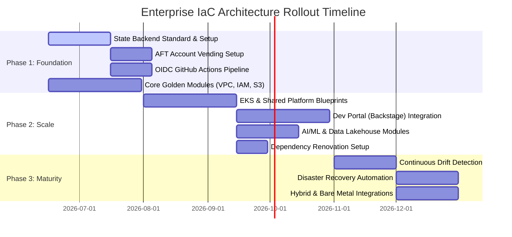

# Enterprise IaC Architecture: Implementation Plan

**Implementation Plan Metadata:**
* **Target Architecture Document:** [large_org_iac_architecture.md](file:///Users/prashantkumar/MyDocument/workspace/openclaw-sandbox/workspace/terraform-ws/org-large/docs/large_org_iac_architecture.md)
* **Version:** 1.0.0
* **Status:** Draft / Ready for Review
* **Date:** 2026-06-16

---

## 1. Executive Summary

This document serves as the technical **Implementation Plan** to transition the enterprise from a monolithic and directory-nested IaC structure to a secure, scalable **Multi-Account, Multi-State, Multi-Repository** GitOps architecture. 

The goal is to support **300+ applications** and **40+ squads** while satisfying strict compliance frameworks (PCI-DSS, SOC 2, GDPR, FedRAMP). This plan detail-maps the rollout in three sequential phases: **Foundation**, **Scale**, and **Maturity**.



---

## 2. Component Architecture Mapping

To maintain strict isolation and control blast radius, we partition the organization infrastructure into version-controlled modules and repositories divided across three operational tiers:

```
Platform & Core Tier
├── aws-organization (AFT Managed)
├── aws-cloud-wan
└── aws-control-tower / Service Control Policies (SCPs)
│
├── Shared Services & Platform Tier (SSM Parameter / Service Discovery exposed)
│   ├── EKS Cluster Blueprints (Karpenter, Istio Ambient, OTel)
│   ├── Aurora Global Databases
│   └── AWS Secrets Manager & KMS Multi-Region Keys
│
└── Application Workload Tier (Self-service / Golden Modules)
    ├── app-s3-bucket / app-dynamodb-table
    ├── app-lambda-function / app-ecs-service
    └── app-sqs-queue
```

---

## 3. Phase-by-Phase Technical Implementation Steps

### Phase 1: Foundation (Months 1–3) — Core Guardrails & Pipelines

#### Step 1.1: Standardize the State Backend Infrastructure
We provision isolated state storage per AWS Account to ensure compliance, security, and prevent cross-account lock contention.

- **Action**: Implement the `modules/security/terraform-state-backend` module in the Core Infra repository.
- **Task**: Provision one S3 bucket (`company-tfstate-{ACCOUNT_ID}`) and one DynamoDB table (`terraform-locks`) per AWS Account using AFT (Account Factory for Terraform) global customizations.
- **Security Check**: Enforce KMS Customer Managed Keys (CMK), S3 Object Versioning, Bucket Public Access Blocks, and DynamoDB Point-in-Time Recovery.

#### Step 1.2: Establish OIDC GitHub Actions Authentication
Secure deployment pipelines by disabling static AWS credentials and moving exclusively to OIDC federated trust.

- **Action**: Deploy `modules/security/github-oidc` to establish an IAM OIDC provider.
- **Task**: Configure Plan (`GitHubActions-TerraformPlan`) and Apply (`GitHubActions-TerraformApply`) roles with restricted trust policies.
- **Security Constraint**: Pin trust policy subject claim conditions directly to the organization and repository:
  `"token.actions.githubusercontent.com:sub": "repo:company/app-repo-name:*"`
- **Workflow Promotion**: Lock the Apply role strictly to commits merged into the `main` branch.

#### Step 1.3: Deploy AWS Control Tower Account Factory for Terraform (AFT)
Automate multi-account provisioning to streamline LOB account onboarding.

- **Action**: Deploy the `aft-account-request` and `aft-account-customizations` frameworks.
- **Task**: Define account blueprints containing baseline VPC configurations, standard tag modules, developer IAM boundaries, and security tool enrollments (GuardDuty, Security Hub, Inspector, AWS Config).

#### Step 1.4: Implement Foundation Golden Modules & Policy-As-Code Gating
- **Action**: Write the core Golden Modules (`aws-vpc`, `app-s3-bucket`, `app-dynamodb-table`, `standard-tags`).
- **Task**: Build the central CI pipeline testing modules using `tflint` and `Checkov`.
- **Policy Enforcement**: Define Checkov and OPA (Open Policy Agent) rules to block pull requests failing security baselines (e.g. unencrypted S3 buckets or open routing configurations).

---

### Phase 2: Scale (Months 3–6) — Platform Blueprints & Developer Portal

#### Step 2.1: Implement Shared Platform Modules (EKS, Aurora, Secrets, KMS)
- **Action**: Build the `eks-cluster-blueprint` module, configuring:
  - Karpenter for node autoscaling.
  - Istio Ambient service mesh for traffic management and mTLS.
  - OpenTelemetry (OTel) collectors for centralized metrics/traces collection.
- **Action**: Build the `aurora-global-database` module supporting cross-region active-active read-replicas with write forwarding.
- **Action**: Deploy centralized `kms-multi-region-key` module configurations to manage MRKs prefixed with `mrk-`.

#### Step 2.2: Integrate with Developer Portal (Backstage)
Transition the workflow to a Developer-as-a-Product platform model.

- **Action**: Configure Backstage templates for the primary workload types.
- **Task**: When a developer requests a new service, Backstage must:
  1. Trigger OIDC role creation and account vending via AFT.
  2. Create a new application Git repository populated with standard boilerplate `main.tf` files calling Golden Modules.
  3. Register the workspaces in ArgoCD.

#### Step 2.3: Build Specialized Workload Modules
Provide standardized templates for AI/ML and Data Lakehouse teams.

- **Action**: Implement the `sagemaker-hyperpod` training cluster module, EKS GPU Karpenter `NodePool` configurations, and `fsx-lustre` high-performance storage module.
- **Action**: Implement the `data-lakehouse` module utilizing AWS Lake Formation for cell-level security and S3 tables utilizing the Iceberg format with compliant Object Lock (SEC 17a-4 compliance).

#### Step 2.4: Deploy Automated Dependency Management
- **Action**: Setup **Renovate** on all 300+ application repositories.
- **Task**: Configure Renovate to scan Terraform provider constraints and Golden Module versions, automatically submitting PRs when minor/patch updates are published.

---

### Phase 3: Maturity (Months 6–12) — Governance & Resilience

#### Step 3.1: Configure Continuous Drift Detection
Prevent manual resource modifications from creating environmental drift.

- **Action**: Provision `modules/observability/drift-detection` utilizing CloudWatch Events and Lambda.
- **Task**: Run automated scheduled `terraform plan` checks in read-only mode every Monday at 6 AM UTC across all active workspaces.
- **Alerting**: Stream plan changes to SNS and Slack, notifying team owners of resource drifts.

#### Step 3.2: Automate Disaster Recovery (DR) and Backup Validation
- **Action**: Standardize backups using AWS Backup with Immutable Vault Lock.
- **Task**: Deploy AWS Step Functions executing automated monthly restore tests in isolated ephemeral environments to validate RTO/RPO targets.
- **Task**: Perform quarterly Active-Standby ArgoCD regional failover drills to ensure recovery time remains below 5 minutes.

#### Step 3.3: Deliver Hybrid & Legacy System Integration Modules
- **Action**: Implement the `hybrid-connectivity` module, providing active-standby 100Gbps Direct Connect (DX) routing alongside automated VPN failover.
- **Action**: Deploy the `bare-metal-host` module supporting EC2 bare-metal placements for licensing-constrained mainframe workload interfaces.

---

## 4. Workload Migration & Progressive Adoption Roadmap

For the existing 300+ applications, we use a maturity-based adoption ladder rather than a single disruptive migration event.

```
Maturity Ladder:
[Level 0: Raw HCL] ──> [Level 1: Golden Modules] ──> [Level 2: GitOps Pipeline] ──> [Level 3: Portal Vended] ──> [Level 4: OPA Gated]
```

### Step-by-Step Legacy Migration Procedure

When migrating an existing application from monolithic/raw HCL to the Golden Module standard, teams must follow this sequence:

1. **Backup State**: Pull a local copy of the existing state file before any operations:
   ```bash
   terraform state pull > backup_state.json
   ```
2. **Apply Import Blocks**: Use Terraform 1.5+ declarative `import` blocks to map existing resources into the golden module definitions without deleting them:
   ```hcl
   import {
     to = module.app_s3_bucket.aws_s3_bucket.this
     id = "existing-legacy-bucket-name"
   }
   ```
3. **Run Dry Run Plan**: Run a plan to verify that the configurations match and that zero resource replacements or deletions are scheduled:
   ```bash
   terraform plan
   ```
4. **Remove Import Blocks**: Once the state is imported successfully, delete the `import` blocks from the code, commit the thin `main.tf`, and transition the deployment pipeline to the GitHub Actions OIDC environment.

---

## 5. Verification Plan

Prior to finalizing any platform changes, the platform team must run validation tests to confirm implementation.

### Automated Verification Pipeline
```bash
# 1. Format and validation checks
terraform fmt -recursive -check
terraform validate

# 2. Static Security analysis (fails on alerts with severity >= HIGH)
checkov --directory . --framework terraform --soft-fail false

# 3. Code Linter checks
tflint --recursive

# 4. Infrastructure integration tests via Terratest
go test -v ./test/...
```

### Manual Verification Milestones
1. **Onboarding Validation**: Verify that creating a mock service via Backstage completes within 15 minutes, resulting in an active GitHub repository, OIDC authentication configuration, and synced ArgoCD application.
2. **Game Day DR Test**: Execute AWS Fault Injection Simulator (FIS) scenarios on secondary regional clusters to confirm active-standby switchover takes less than 5 minutes.
3. **Drift Alert Loop**: Manually edit a security group in the AWS Console on a test account and verify that the drift detection pipeline registers the change, triggers a Slack alert, and isolates the diff correctly.
