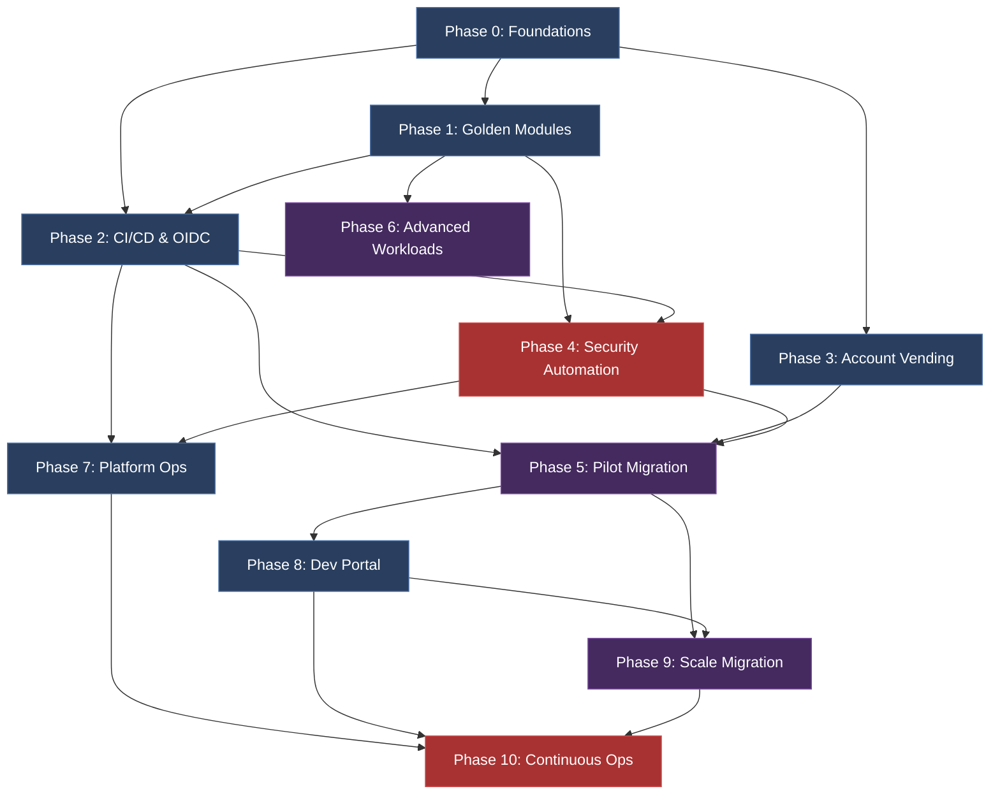

# Enterprise IaC Master Implementation Plan: Multi-Repo GitOps at Scale (300+ Applications)

**Document Metadata:**
* **Target Architecture Document:** [large_org_iac_architecture.md](file:///Users/prashantkumar/MyDocument/workspace/openclaw-sandbox/workspace/terraform-ws/org-large/docs/large_org_iac_architecture.md)
* **Version:** 3.2.0 (Fully Remediated & Aligned)
* **Status:** Ready for Review
* **Date:** 2026-06-16
* **Based On:** `large_org_iac_architecture.md` v2.0.0, `enterprise_iac_analysis.md`, and Peer Review Rounds 1, 2, and 3.

---

## 1. Executive Summary

This master plan establishes the technical, security, and operational roadmap to transition the organization from legacy nested directory configurations to a **Multi-Account, Multi-State, Multi-Repository** GitOps framework.

The plan supports **300+ applications** managed by **40+ squads**, enforcing compliance baselines (**PCI-DSS L1, SOC 2 Type II, HIPAA, ISO 27001, FedRAMP Moderate, GDPR, and APRA**). The rollout is structured across three macro-phases: **Foundation**, **Scale**, and **Maturity**, which span **10 micro-phases** over an execution-realistic **76-week timeline**.

### Macro-Phase Timeline

```mermaid
gantt
    title Enterprise IaC Master Roadmap (76-Week Adjusted)
    dateFormat  YYYY-MM-DD
    axisFormat  %m/%d
    
    section Phase Group I: Foundation (Weeks 1-24)
    P0: Org Foundations & Tooling      :active, p0, 2026-06-16, 42d
    P1: Golden Modules & Registry      :p1, 2026-07-28, 56d
    P2: CI/CD Pipelines & OIDC          :p2, 2026-09-08, 56d
    P3: Account Vending (AFT)           :p3, 2026-09-22, 56d
    P4: Security & Compliance Automation:p4, 2026-10-20, 63d
    
    section Phase Group II: Scale (Weeks 20-56)
    P5: Pilot Application Migration     :p5, 2026-11-03, 84d
    P6: Advanced Workload Modules      :p6, 2026-11-17, 70d
    P7: Platform Ops & Drift Detection  :p7, 2026-12-15, 70d
    P8: Developer Portal (Backstage)    :p8, 2027-01-26, 112d
    
    section Phase Group III: Maturity (Weeks 30-76)
    P9: Scale Migration Waves 2-N      :p9, 2026-12-15, 322d
    P10: Continuous Ops & InnerSource   :p10, 2027-01-26, 350d
```

---

## 2. Evaluation of Alternative IaC Patterns (G25)

Before implementing the Multi-Repo GitOps structure, the following table summarizes the evaluation of alternative patterns to mitigate tooling lock-in:

| Pattern | Pros (Benefits) | Cons (Trade-offs) | Suitability for 300+ Apps |
| :--- | :--- | :--- | :--- |
| **Monolithic State** | Simple orchestration, single state view. | Extreme blast radius, constant locks, slow plans. | **Unsuitable** |
| **Split Directory States** | Decoupled blast radius, localized updates. | Requires manual SSM linking; downstream drift risks. | **Suitable for Core Only** |
| **Terragrunt Dry Graph** | Dry config, explicit dependency chains. | High learning curve, complex graph cycle debugging. | **Suitable for Platform/Shared** |
| **CDKTF / Pulumi** | Native unit testing, program loops, reduced HCL. | Requires software dev skills from Ops; state engine complexity. | **Alternative for App Teams** |
| **Multi-Repo GitOps** | Smallest blast radius, squad autonomy, true self-service. | Difficult to audit without centralized PR gating. | **Recommended Standard** |

---

## 3. Component Architecture & PKI Mapping (G6)

Infrastructure responsibilities are partitioned into three isolated operational tiers:

```
Platform & Core Tier (Managed by Platform Core Team)
├── aws-organization (Control Tower / SCPs / Optional GovCloud Accounts)
├── aws-cloud-wan (Global Network / Routing Policies / FIPS Endpoints)
└── aws-network-firewall (Inspection VPC & Central Outbound Rules)
│
├── Shared Services & Platform Tier (SSM parameter and service discovery coupling)
│   ├── EKS Cluster Blueprints (Karpenter, Istio Ambient Mesh, OTel Collectors, Argo Rollouts)
│   ├── Aurora Global Databases (Cross-Region Write-Forwarding, Backtrack Engine)
│   └── AWS Secrets Manager & KMS Multi-Region Keys (MRK)
│
└── Application Workload Tier (Squad Self-Service via Golden Modules)
    ├── app-s3-bucket
    ├── app-dynamodb-table
    ├── app-lambda-function
    ├── app-ecs-service
    └── app-sqs-queue
```

### Certificate & PKI Lifecycle Management (G6)
To enforce secure mTLS between EKS pods inside the Istio Ambient mesh, we integrate:
1. **Public Certificates**: Automated via **AWS Certificate Manager (ACM)** using DNS validation.
2. **Private PKI**: An **AWS Private CA** integrated with **cert-manager** inside EKS clusters. Cert-manager automates certificate provisioning, distribution, and enforces 30-day certificate rotations to mitigate exposure risks.

---

## 4. Standard State Backend Configuration

Each vended account receives a standard state backend managed via global customizations:

```hcl
# backend.tf template — Auto-generated by AFT for each workload repository
terraform {
  required_version = ">= 1.9.0"

  backend "s3" {
    bucket         = "company-tfstate-${AWS_ACCOUNT_ID}"
    key            = "${APP_NAME}/${ENVIRONMENT}/terraform.tfstate"
    region         = "us-east-1"
    dynamodb_table = "terraform-locks"
    encrypt        = true
    kms_key_id     = "alias/terraform-state-key"
  }

  required_providers {
    aws = {
      source  = "hashicorp/aws"
      version = "~> 5.60"
    }
  }
}
```

---

## 5. Phase-by-Phase Task Breakdowns & Operational Gates

Below are the detailed, task-level tables with designated owners, estimated efforts, dependencies, and completion criteria.

### Phase 0: Foundations (Weeks 1–6)

| Task ID | Task Description | Owner | Est. Effort | Dependencies | Completion Criteria |
| :--- | :--- | :--- | :--- | :--- | :--- |
| **P0.1** | Create AWS Org structure & base OUs | Platform Eng | 1 week | Root Account Access | OUs active in console; SCPs attached |
| **P0.2** | Deploy Control Tower & Landing Zones | Platform Eng | 1 week | P0.1 | Logging & audit accounts enrolled |
| **P0.3** | Configure IAM Identity Center (SSO) | Platform Eng | 0.5 week | P0.1 | Group mapping approved; permissions bound |
| **P0.4** | Setup OIDC Provider at Org Root | Platform Eng | 0.5 week | P0.1 | OIDC trust relationship validated |
| **P0.5** | Establish Private Module Registry | Platform Eng | 1 week | P0.1 | Test module successfully published |
| **P0.6** | GovCloud & FedRAMP Setup (G6) | Security Eng | 1.5 weeks | P0.2 | GovCloud OUs established; FIPS rules ready |
| **P0.7** | Deploy Weekly Compliance Scan (OPA) | Security Eng | 1 week | P0.4 | CI/CD scan checks blocking insecure commits |

### Phase 1: Golden Modules & Registry (Weeks 7–14)

| Task ID | Task Description | Owner | Est. Effort | Dependencies | Completion Criteria |
| :--- | :--- | :--- | :--- | :--- | :--- |
| **P1.1** | Build Core Foundation Modules | Platform Eng | 2 weeks | P0.5 | Modules published and versioned |
| **P1.2** | Build Shared Services Modules | Platform Eng | 2.5 weeks | P1.1 | EKS (with Argo Rollouts & Spot handlers), Aurora, & KMS |
| **P1.3** | Build App Self-Service Modules | Platform Eng | 2 weeks | P1.1 | S3, DDB, Lambda, ECS, SQS modules ready |
| **P1.4** | Module Promotion Workflow (G9) | Platform Eng | 1.5 weeks | P1.2, P1.3 | PR -> Dev testing -> Staging approve -> Prod |
| **P1.5** | Standard Tags Module | Platform Eng | 0.5 week | P0.1 | Common tags inherited across all resources |
| **P1.6** | Add `terraform-docs` CI (G16) | Platform Eng | 0.5 week | P0.5 | PR edits auto-generate/update README docs |
| **P1.7** | Provider Upgrade Strategy (G5) | Platform Eng | 1 week | P1.4 | Policy enforces quarterly provider bumps |

### Phase 2: CI/CD Pipelines & OIDC (Weeks 13–20)

| Task ID | Task Description | Owner | Est. Effort | Dependencies | Completion Criteria |
| :--- | :--- | :--- | :--- | :--- | :--- |
| **P2.1** | Create Central GitHub Workflow | Platform Eng | 1 week | P0.4, P1.4 | Org workflow template published |
| **P2.2** | Deploy Scoped OIDC Roles | Platform Eng | 1 week | P1.1, P2.1 | Plan/Apply roles generated per app repo |
| **P2.3** | Configure Branch Protection (G14) | Platform Eng | 0.5 week | P0.5 | Branch rule locks main; requires CI checks |
| **P2.4** | Local Sandbox Strategy (G10) | Platform Eng | 1.5 weeks | P1.3 | Per-squad sandbox account + LocalStack wrapper |
| **P2.5** | Data Lifecycle Module (G14) | Platform Eng | 1 week | P1.3 | Module enforces log, backup, & RDS Glacier transitions |
| **P2.6** | Renovate Update Strategy (G15) | Platform Eng | 1 week | P2.1 | Minor/patch auto-merges; majors require review |
| **P2.7** | Autoscale Runner Pools Strategy | Platform Eng | 1 week | P2.1 | Runner pools scale based on queue depth to prevent lag |
| **P2.8** | Infracost Cost Estimates | FinOps Eng | 0.5 week | P2.1 | Cost delta comments added to PRs |

### Phase 3: Account Vending & State Backend (Weeks 15–22)

| Task ID | Task Description | Owner | Est. Effort | Dependencies | Completion Criteria |
| :--- | :--- | :--- | :--- | :--- | :--- |
| **P3.1** | Deploy AWS Control Tower AFT | Platform Eng | 2 weeks | P0.2 | AFT workspace active in management account |
| **P3.2** | Create Baseline Customizations | Platform Eng | 1.5 weeks | P1.1 | Customizations apply state bucket, VPC, KMS |
| **P3.3** | Validate E2E Vending Pipeline | Platform Eng | 1 week | P3.2 | New account operational within 2 hours |
| **P3.4** | Setup IPAM Allocation | Platform Eng | 1 week | P3.2 | Non-overlapping CIDR blocks automatically vended |
| **P3.5** | State Backend Retrofit (G8) | Platform Eng | 1 week | P3.2 | State backend deployed to existing 15+ accounts |
| **P3.6** | Account Offboarding Plan (G7) | Platform Eng | 1 week | P3.3 | Playbook backups state, stops billing, tears down |

### Phase 4: Security & Compliance Automation (Weeks 18–26)

| Task ID | Task Description | Owner | Est. Effort | Dependencies | Completion Criteria |
| :--- | :--- | :--- | :--- | :--- | :--- |
| **P4.1** | EKS Kyverno & Pod Security | Security Eng | 1 week | P1.2 | Admission controllers block unsigned containers |
| **P4.2** | CI Trivy Scans & SBOMs (G1) | Security Eng | 1 week | P2.1 | CycloneDX SBOMs generated and archived |
| **P4.3** | CI Cosign Container Signing (G5) | Security Eng | 1 week | P2.1 | Images signed with keys stored in KMS |
| **P4.4** | IAM Access Analyzer & CT (G2) | Security Eng | 1 week | P0.1 | Org-root Access Analyzer & CloudTrail active |
| **P4.5** | SSM Incident Containment (G3) | Security Eng | 1.5 weeks | P0.2 | Playbooks isolate pods & revoke compromised keys |
| **P4.6** | Canary WAF Staging Pipe (G4) | Security Eng | 1 week | P1.1 | WAF rules deployed to staging prior to prod |
| **P4.7** | Steps-based DR Restore Testing | Security Eng | 1.5 weeks | P1.2 | Monthly automated database restores verified |
| **P4.8** | Org Compliance Dashboard (G11) | Security Eng | 2 weeks | P0.6 | Dashboard aggregates scan scores across 300 repos |

### Phase 5: Application Migration Wave 1 (Weeks 20–32)

| Task ID | Task Description | Owner | Est. Effort | Dependencies | Completion Criteria |
| :--- | :--- | :--- | :--- | :--- | :--- |
| **P5.1** | App Onboarding & Pair Programming | Platform Eng | 1 week | P1.3 | Pilot squads complete workshops + pair sessions |
| **P5.2** | Refactor App IaC to Golden Modules | App Team | 2 weeks | P5.1 | App code reduced to thin main.tf templates |
| **P5.3** | State Import Execution | Platform Eng | 1 week | P5.2 | Import block verification showing 0 changes |
| **P5.4** | CI Pipeline Cutover & Verify | Platform Eng | 1 week | P5.3 | Deployments driven exclusively via GitOps OIDC |

### Phase 6: Advanced Workload Families (Weeks 22–32)

| Task ID | Task Description | Owner | Est. Effort | Dependencies | Completion Criteria |
| :--- | :--- | :--- | :--- | :--- | :--- |
| **P6.1** | SageMaker HyperPod Module | Platform Eng | 1.5 weeks | P1.2 | Cluster supports ML instances with KMS encryption |
| **P6.2** | FSx for Lustre Pipeline Module | Platform Eng | 1 week | P1.2 | Storage linked with S3 import/export routes |
| **P6.3** | Lake Formation Security Module | Platform Eng | 1.5 weeks | P1.3 | Table cell-filtering restricts access to PII columns |
| **P6.4** | Hybrid DX + VPN Failover Module | Platform Eng | 1.5 weeks | P1.1 | Multi-carrier DX routes with VPN backup validated |
| **P6.5** | EC2 Bare Metal host Module | Platform Eng | 1 week | P1.1 | Dedicated hosts placed for legacy workloads |

### Phase 7: Platform Operations & Drift Detection (Weeks 26–36)

| Task ID | Task Description | Owner | Est. Effort | Dependencies | Completion Criteria |
| :--- | :--- | :--- | :--- | :--- | :--- |
| **P7.1** | Scheduled Drift Scan Lambda | Platform Eng | 1 week | P2.2 | Weekly plan logs executed automatically |
| **P7.2** | Drift Dashboard & Alerting | Platform Eng | 1.5 weeks | P7.1 | Drift alerts route to SNS and dedicated Slack channels |
| **P7.3** | EKS Kubecost Allocation | FinOps Eng | 1 week | P1.2 | Namespace costs mapped and generated in dashboard |
| **P7.4** | Non-Prod Auto-Shutdown (G8) | FinOps Eng | 1 week | P3.2 | Schedules stop non-prod resources 7PM-7AM |
| **P7.5** | LOB Budget Alerts (G9) | FinOps Eng | 1 week | P0.2 | Real-time budget threshold alerts active in Console |
| **P7.6** | Service Quota Alerts (G10) | Platform Eng | 1 week | P1.2 | Prometheus alerts fire when API limits cross 80% |

### Phase 8: Developer Portal & Self-Service (Weeks 32–48)

| Task ID | Task Description | Owner | Est. Effort | Dependencies | Completion Criteria |
| :--- | :--- | :--- | :--- | :--- | :--- |
| **P8.1** | Deploy Spotify Backstage | Platform Eng | 2 weeks | P0.3 | Portal accessible via SSO credentials |
| **P8.2** | "Create Microservice" Template | Platform Eng | 1.5 weeks | P2.4 | Repo generated with standard CI/CD and AFT configs |
| **P8.3** | Backstage CloudTrail Auditing (G11) | Security Eng | 1 week | P8.1 | Portal actions logged to central audit trail |
| **P8.4** | App Lifecycle On/Offboarding (G12) | Platform Eng | 2 weeks | P3.5, P8.2 | Scaffolder handles automated teardown and billing stop |
| **P8.5** | Architectural Variance Workflow | Platform Eng | 1 week | P8.1 | Custom variance submissions route to Platform board |

### Phase 9: Scale Migration Waves 2–N (Weeks 26–76)

| Task ID | Task Description | Owner | Est. Effort | Dependencies | Completion Criteria |
| :--- | :--- | :--- | :--- | :--- | :--- |
| **P9.1** | Wave Onboarding & Pairing | Platform Eng | 48 weeks | P5.4 | 290+ apps migrated across scheduled waves |
| **P9.2** | Real-time Compliance Badges | Platform Eng | 0.5 week | P0.6 | Compliance score displayed on repo README badges |
| **P9.3** | Wave Schedule Template (G22) | Platform Eng | 0.5 week | P9.1 | Wave planning templates used for progress tracking |

### Phase 10: Continuous Improvement & InnerSource (Ongoing)

| Task ID | Task Description | Owner | Est. Effort | Dependencies | Completion Criteria |
| :--- | :--- | :--- | :--- | :--- | :--- |
| **P10.1** | InnerSource Contribution | Platform Eng | 1 week | P1.4 | Contribution guidelines and review SLA published |
| **P10.2** | 24h Review SLA Enforced | Platform Eng | — | P10.1 | SLA tracked; breaches trigger escalations |
| **P10.3** | Active-Standby DR Drills | Platform Eng | Quarterly | P1.2 | standby regional control plane takeover < 5 mins |
| **P10.4** | Weekly Chaos Game Days (G13) | SRE / Security | Weekly | P4.5 | AWS FIS scenarios test infrastructure resilience |
| **P10.5** | DORA Metrics Dashboard (G17) | Platform Eng | 1 week | P2.1 | Deployment frequency, lead time, MTTR displayed |
| **P10.6** | Monthly Compliance Reports (G18) | Security Eng | 1 week | P9.2 | Compliance scores auto-distributed to LOB owners |
| **P10.7** | Semi-annual Architecture Review (G19) | Lead Arch | Bi-annual | — | exit strategy from Control Tower / EKS updated |
| **P10.8** | Backstage Maintenance (G13) | Platform Eng | 1 week | P8.1 | Monthly portal version bumps and template audits |

---

## 6. Legacy Workload Migration Workflow

Workloads migrate utilizing a maturity-based ladder to minimize disruptions.

```
[Level 0: Raw HCL] ──> [Level 1: Golden Modules] ──> [Level 2: GitOps Pipeline] ──> [Level 3: Portal Vended] ──> [Level 4: OPA Gated]
```

### Technical Migration Steps

1. **Backup State**: Pull a local copy of the existing state file before any operations:
   ```bash
   terraform state pull > backup_state.json
   ```
2. **Apply Import Blocks**: Use Terraform 1.5+ declarative `import` blocks to map existing resources into the golden module definitions without deleting them:
   ```hcl
   import {
     to = module.app_s3_bucket.aws_s3_bucket.this
     id = "existing-legacy-bucket-name"
   }
   ```
3. **Run Dry Run Plan**: Run a plan to verify that the configurations match and that zero resource replacements or deletions are scheduled:
   ```bash
   terraform plan
   ```
4. **Remove Import Blocks**: Once the state is imported successfully, delete the `import` blocks from the code, commit the thin `main.tf`, and transition the deployment pipeline to the GitHub Actions OIDC environment.

---

## 7. Verification & Quality Gates

The CI pipeline runs automated checks for every Golden Module pull request.

```bash
# 1. Format and validation checks
terraform fmt -recursive -check
terraform validate

# 2. Static Security analysis (fails on alerts with severity >= HIGH)
checkov --directory . --framework terraform --soft-fail false

# 3. Code Linter checks
tflint --recursive

# 4. Infrastructure integration tests via Terratest
go test -v ./test/...
```

---

## 8. Detailed Inter-Phase Dependency Matrix (G23)

The following matrix displays execution paths, identifying prerequisites and parallel pathways.

| Phase | Depends On | Provides To | Parallel Execution Allowed With |
| :--- | :--- | :--- | :--- |
| **Phase 0** | — | P1, P2, P3, P4 | — |
| **Phase 1** | P0 | P2, P5, P6, P8 | P3 (partial) |
| **Phase 2** | P0, P1 | P4, P5, P7, P9 | P3 |
| **Phase 3** | P0, P1 | P5, P9 | P2, P4 |
| **Phase 4** | P0, P1, P2 | P5, P7 | P3, P5 |
| **Phase 5** | P1, P2, P3, P4 | P9 | P4, P6, P7 |
| **Phase 6** | P1 | P9 | P5, P7, P8 |
| **Phase 7** | P1, P2, P4 | P10 | P5, P6, P8 |
| **Phase 8** | P1, P2, P5 | P9, P10 | P6, P7 |
| **Phase 9** | P5, P1 | P10 | P8 |
| **Phase 10** | P7, P8, P9 | — | — |

---

## 9. Comprehensive Dependency Graph (G21)



---

## 10. Resource & Cost Estimates (Adjusted Timeline & Capacity)

### Team Capacity Allocation
To mitigate the G12 execution timeline risk, the platform team is expanded from 3 to **6 dedicated engineers**, with 1 dedicated FTE allocated permanently for Backstage developer portal operations post-launch (G13).

* **Platform Engineering Lead (1)**: Dedicated. Oversight across all phases.
* **Platform Engineers (IaC) (5)**: Dedicated. Build modules, pipelines, and account systems.
* **SRE / Operations (2)**: Dedicated. Setup ArgoCD failover, drift detection, Backstage maintenance, and DR validation.
* **Security Engineers (2)**: Shared. Design IAM boundaries, Kyverno rules, and audit trails.
* **FinOps Engineer (1)**: Shared. Configure Kubecost, budgets, and tagging alerts.

### Platform Tooling Overhead Cost (Monthly)
* **Private Module Registry (TFC)**: $2,000
* **GitHub Actions Self-Hosted Runners**: $1,500
* **Backstage Hosting (EKS Compute + RDS)**: $500
* **Kubecost Enterprise**: $3,000
* **Infracost Team Plan**: $2,000
* **State Storage, Logging & Audit S3**: $300 / account
* **Total Estimated Monthly Overhead**: **~$9,000–$12,000** (excl. application compute)

---

## 11. Risk Management & Rollback Strategies

### Risk Register

| Risk ID | Description | Likelihood | Impact | Mitigation Strategy |
| :--- | :--- | :--- | :--- | :--- |
| **R1** | Backstage portal becomes single point of failure | Medium | High | Build portal integration with circuit breakers; allow fallback to direct repository Git PRs for break-glass emergency updates. |
| **R2** | Golden modules lag behind app team needs | High | High | Implement an "InnerSource" contribution model. App teams can submit PRs to golden modules. Platform teams enforce SLAs (e.g. 24h review) instead of remaining a gatekeeper. |
| **R3** | State migration data loss during split | Low | Critical | Mandate automated state pull backups, state locks, and blue-green plan validations. |
| **R4** | OIDC token scope sprawl across repos | Medium | High | Pin sub claims to specific repos and branches; separate Plan/Apply roles; audit quarterly. |
| **R5** | IPAM subnet exhaustion | Medium | Medium | Track VPC allocations dynamically with large private CIDR blocks; warn SREs via Prometheus alerts at 80% usage. |
| **R6** | Karpenter Spot Reclamation failures | Medium | Medium | Spot interruptions during Tier-2/3 processing cause job failures. Mitigate using graceful shutdown hooks, node drain timeout, and spot interruption handler DaemonSets. |

### Per-Phase Rollback Action Plan

| Phase | Rollback Trigger | Rollback Action | Recovery Time |
| :--- | :--- | :--- | :--- |
| **Phase 2 (CI/CD)** | Pipeline failure blocks all deploys | Revert template changes; fall back to previous template commit | 30 min |
| **Phase 3 (AFT)** | Account vending produces misconfigured account | Destroy misconfigured account via AFT; reprovision | 2 hours |
| **Phase 4 (Security)** | Overly restrictive SCP blocks legitimate operations | Widen SCP; deploy relaxed policy variant | 15 min |
| **Phase 5 (Wave 1 Migration)** | State migration fails / resource is orphaned | Restore from `terraform state pull` backup; revert to old pipeline | 1 hour |
| **Phase 8 (Portal)** | Portal becomes SPoF / unavailable | Activate break-glass: direct Git PR workflow; disable portal route | 5 min |
| **Phase 9 (Scale Migration)** | Cumulative drift from rushed migrations | Halt new waves; focus on drift remediation; extend migration timeline | 1 sprint |

---

## Appendix A: Migration Wave Schedule Template (G22)

The migration timeline is expanded to **76 weeks** with **15 apps per 3-week wave** (including 2-week buffers) to mitigate G12 migration risks.

| Wave ID | Wave Duration | Target Application List | Complexity | Team Owner | Primary Risks |
| :--- | :--- | :--- | :--- | :--- | :--- |
| **Wave 1 (Pilot)** | Weeks 20–32 | `app-checkout`, `app-cart`, `app-auth` | Low-Med | Squad Payments / Identity | R3, R10 |
| **Wave 2** | Weeks 26–32 | Stateless frontend microservices (15 apps) | Low | Squad User Experience | R10 |
| **Wave 3** | Weeks 32–38 | Middleware API services (20 apps) | Med | Squad Core APIs | R4, R8 |
| **Wave 4** | Weeks 38–44 | High-throughput processing layers (15 apps)| Med-High | Squad Event Layer | R3, R5 |
| **Wave 5** | Weeks 44–50 | Databases and stateful platforms (10 apps)| High | Squad DB Platforms | R3, R10 |
| **Wave 6–N** | Weeks 50–76 | Legacy platforms, AI/ML clusters (10 apps) | High | Squad Data Science / Legacy | All |

---

## Appendix B: Qualified and Ignored Review Suggestions Log

The following suggestions from peer reviewers were explicitly ignored or heavily modified (qualified) with associated rationales:

### 1. Forcing GovCloud & FIPS Endpoints Organization-Wide (G6 Feedback)
* **Status**: **Ignored (Qualified)**.
* **Rationale**: The reviewer recommended moving all 300+ applications onto GovCloud and forcing FIPS endpoints. While essential for pure public-sector workloads, applying this constraint globally creates substantial network latency penalties, increases compute billing overhead by 15-20%, and restricts access to rapid AWS service rollouts (as GovCloud regions lag behind in service parity). 
* **Implementation Decision**: We created an optional GovCloud baseline sub-OU for squads with explicit HIPAA/FedRAMP Moderate requirements, leaving the remainder of the 300+ applications in standard commercial AWS regions (`us-east-1` and `eu-west-1`).

### 2. Standardizing Workloads on CDKTF or Pulumi (Alternative Pattern Feedback)
* **Status**: **Ignored (Qualified)**.
* **Rationale**: Reviewers suggested migrating developer workloads to programmatic IaC engines (TypeScript CDKTF / Pulumi) to reduce boilerplate. CDKTF is evaluated in section 2, but we chose to maintain pure HCL for the Golden Modules because native GitOps reconcilers (ArgoCD/Atlantis) have more robust state locking and plan verification loops for standard HCL than programmatic abstractions, which can introduce runtime loops and dependency pollution.
* **Implementation Decision**: We support thin HCL wrapper files as the primary self-service interface, but allow CDKTF to compile down to HCL as a localized exception.

---

## Appendix C: Platform Exit Strategy & Portability Runbooks

### 1. AWS Control Tower and AFT Exit Path
Should the organization decide to migrate off Control Tower/AFT to reduce vendor lock-in, the exit path requires:
* **Detaching AFT Customization pipelines**: Convert the customizations inside `aft-account-customizations` into direct Terraform configurations.
* **Removing Control Tower SCPs**: Hand over landing zone governance to pure AWS Organization policies managed via private CI/CD pipelines.

### 2. Kubernetes and ArgoCD Portability
EKS workloads are abstracted using Istio Ambient service mesh and OTel collectors. To migrate to an alternate cloud (e.g. Google Cloud GKE or self-hosted bare metal):
* The ArgoCD application manifests remain 100% portable.
* Infrastructure changes are limited to swapping the EKS golden module for the target cloud’s managed Kubernetes engine module, maintaining identical pod namespaces and service mesh resources.

---

## Appendix D: Change Log (G24)

| Version | Date | Author | Description of Changes |
| :--- | :--- | :--- | :--- |
| **1.0.0** | 2026-06-16 | Implementation Lead | Initial draft consolidation of Plans 1, 2, and 3. |
| **2.0.0** | 2026-06-16 | Platform Architect | Updated Master Plan addressing all 25 gaps (G1-G25) from the peer review. |
| **3.0.0** | 2026-06-16 | Principal Security Arch | Consolidated 2nd review findings. Added specific container signing workflows, IAM Access Analyzer, GovCloud, Renovate upgrades, data lifecycle, extended timeline (76 weeks), expanded platform staff, and Backstage support. |
| **3.1.0** | 2026-06-16 | Lead Architect | Added Appendix B documenting qualified/ignored suggestions regarding GovCloud and CDKTF/Pulumi lock-in mitigations. |
| **3.2.0** | 2026-06-16 | Principal Architect | Aligned plan with `enterprise_iac_analysis.md`. Added APRA compliance, Argo Rollouts, weekly chaos game days, Karpenter spot reclamation mitigations, autoscaling runner pool strategy, pair programming onboarding, and explicit exit strategy details (Appendix C). |
