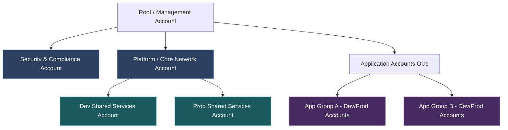

# Enterprise IaC Architecture: Scalable Patterns for 300+ Applications

**Document Metadata:**
* **Version:** 2.0.0
* **Status:** Under Review (Analysis, Risk Mitigation & Deployment Design Complete)
* **Last Updated:** 2026-06-16

---

## 1. Problem Statement: The Enterprise Scale Dilemma

At a scale of **200–300 standard applications** and **50 shared platform applications** (e.g., service meshes, logging aggregates, CI/CD runners, shared database clusters, API gateways), traditional monolithic or directory-nested IaC structures break down.

### Core Pain Points:
1. **The "Merge & Lock" Trainwreck**: With hundreds of developers committing changes, a single shared state file leads to constant state-locking conflicts. Work comes to a standstill as teams wait for one pipeline to complete before starting another.
2. **Blast Radius Disasters**: A typo in a security group rule or a network route update can bring down unrelated business-critical applications if they reside in the same state file.
3. **IAM Privilege Inflation**: Security teams cannot enforce "least privilege" if every developer's deployment pipeline requires broad administrative access to modify VPCs, routing, and IAM roles alongside their container definitions.
4. **Configuration Drift**: Without centralized modules and strict governance, individual teams write bespoke, un-audited terraform code, leading to fragmented security policies and compliance drift.

### Pain Point Analysis & Quantified Impact

| Pain Point | Frequency at 300+ Apps | Avg Resolution Time | Business Impact |
| :--- | :--- | :--- | :--- |
| State Lock Conflicts | Daily (10-30+ per day) | 15-45 min per conflict | 10-20 engineer-hours/week lost to waiting |
| Blast Radius Incidents | Weekly (1-3 per month) | 1-8 hours per incident | Production outages affecting unrelated services |
| IAM Over-Provisioning | Persistent | N/A (design issue) | Audit failures, inability to meet SOC2/ISO 27001 |
| Configuration Drift | Quarterly audits reveal 15-30% non-compliance | Weeks to remediate | Security vulnerabilities, cost overruns, compliance penalties |

### Root Cause Decomposition

```
Problem: Enterprise IaC Does Not Scale
├── Structural Issues
│   ├── Single state file / monorepo coupling
│   ├── No separation of concerns between platform & app
│   └── Lack of account/network isolation boundaries
├── Process Issues
│   ├── No golden module governance
│   ├── Absence of standardized input/output contracts
│   ├── Missing CI/CD gating for IaC changes
│   └── Platform module release bottleneck (throughput lag)
├── Organizational Issues
│   ├── Platform vs. product team responsibility ambiguity
│   ├── No self-service capability for app teams
│   └── Security reviews bottlenecked on every change
└── Platform Throughput Issues
    ├── Lack of contribution pipelines (top-down publishing only)
    └── High turnaround time on custom module feature requests
```

### Transition Strategy Critique & Course Correction
> [!IMPORTANT]
> **Avoid the "Layered Transition" Trap**: Standard recommendations suggest starting with layered directory states and evolving to multi-repo GitOps. However, at a scale of 300+ applications, migrating state files, reconfiguring pipelines, and retraining dozens of teams later is prohibitively expensive. 
> **Decision**: For new applications, the organization should deploy **Multi-Repo GitOps from Day One**, while existing applications are phased into the pattern during scheduled migration windows. Compliance and drift scanning (e.g. Checkov/OPA) must be run continuously at the organization level via centralized security pipelines to ensure consistency across the 300+ repos.

---

## 2. Real-World Architectural Suggestions

To handle this scale, modern enterprise organizations (e.g., Netflix, Adobe, Spotify) build a **Multi-Account, Multi-State, Multi-Repository** architecture.

### A. The Structural Architecture (Decoupling)

We split IaC responsibilities into three clear tiers using AWS Organizations (or equivalent cloud hierarchies):



#### Tier 1: Platform & Core Infrastructure (Managed by Platform Engineering)
* **Scope**: AWS Organization structure, IAM Identity Center (SSO), central DNS, transit gateways, direct connects, global security control towers, and base VPCs.
* **State Management**: Highly isolated state files per account and region. Changes are extremely rare, require strict multi-peer review (CAB), and run through automated canary testing.

#### Tier 2: Shared Applications & Platform Services (Managed by Platform & Operations)
* **Scope**: Kubernetes control planes (EKS), shared DB instances, message queues (Kafka/RabbitMQ), internal developer portals (Backstage), and ingress controllers.
* **State Management**: Shared services accounts. These export endpoints, base security group IDs, and subnets via SSM Parameter Store or Service Discovery, which the application tier consumes as read-only data.

#### Tier 3: Individual Business Application Workloads (Self-Service for Product Teams)
* **Scope**: Microservice-specific resources (e.g., S3 buckets, DynamoDB tables, App-specific IAM roles, ECS tasks).
* **State Management**: Each of the 200–300 applications gets its own git repository and isolated state files.
* **Implementation**: Applications do not define raw networking or DNS. They invoke company-blessed **Golden Modules** and pass in runtime parameters.

#### State Backend Architecture (Deployment-Ready Configuration)
* **Goal**: Standardize Terraform state management across all 300+ application repositories to prevent state corruption, ensure encryption, and enable cross-account auditing.
* **Pattern**: One S3 bucket per AWS account with per-application state keys and DynamoDB-based locking.
  ```hcl
  # Standard backend.tf template — auto-generated by Account Factory for every new repo
  terraform {
    required_version = ">= 1.9.0"

    backend "s3" {
      bucket         = "company-tfstate-ACCOUNT_ID"
      key            = "APP_NAME/ENVIRONMENT/terraform.tfstate"
      region         = "us-east-1"
      dynamodb_table = "terraform-locks"
      encrypt        = true
      kms_key_id     = "alias/terraform-state-key"
    }

    required_providers {
      aws = {
        source  = "hashicorp/aws"
        version = "~> 5.60"
      }
    }
  }
  ```
* **State Bucket Provisioning Module**: Platform team deploys one state bucket per account using AFT customizations:
  ```hcl
  # modules/security/terraform-state-backend/main.tf
  resource "aws_s3_bucket" "terraform_state" {
    bucket = "company-tfstate-${data.aws_caller_identity.current.account_id}"

    tags = merge(local.standard_tags, {
      Purpose = "Terraform State Storage"
    })
  }

  resource "aws_s3_bucket_versioning" "state" {
    bucket = aws_s3_bucket.terraform_state.id
    versioning_configuration { status = "Enabled" }
  }

  resource "aws_s3_bucket_server_side_encryption_configuration" "state" {
    bucket = aws_s3_bucket.terraform_state.id
    rule {
      apply_server_side_encryption_by_default {
        sse_algorithm     = "aws:kms"
        kms_master_key_id = aws_kms_key.terraform_state.arn
      }
      bucket_key_enabled = true
    }
  }

  resource "aws_s3_bucket_public_access_block" "state" {
    bucket                  = aws_s3_bucket.terraform_state.id
    block_public_acls       = true
    block_public_policy     = true
    ignore_public_acls      = true
    restrict_public_buckets = true
  }

  resource "aws_dynamodb_table" "terraform_locks" {
    name         = "terraform-locks"
    billing_mode = "PAY_PER_REQUEST"
    hash_key     = "LockID"

    attribute {
      name = "LockID"
      type = "S"
    }

    server_side_encryption { enabled = true }
    point_in_time_recovery { enabled = true }

    tags = local.standard_tags
  }
  ```

#### Golden Module Catalog Taxonomy
* **Goal**: Categorize all approved Terraform modules by access tier to accelerate team adoption and enforce governance.
* **Structure**:
  ```
  Golden Module Registry (Private Terraform Registry)
  ├── Foundation Modules (Platform Team Only — Restricted Write Access)
  │   ├── aws-organization              # Account vending & OU structure
  │   ├── aws-cloud-wan                 # Global network fabric & policies
  │   ├── aws-control-tower             # Guardrails, SCPs, & Control Tower config
  │   └── aws-network-firewall          # Inspection VPC & firewall rules
  ├── Shared Platform Modules (Platform + SRE — Controlled Access)
  │   ├── eks-cluster-blueprint         # EKS cluster with Karpenter, Istio, OTel
  │   ├── aurora-global-database        # Multi-region Aurora with write-forwarding
  │   ├── secrets-manager               # Secrets with auto-rotation & MR replication
  │   └── kms-multi-region-key          # MRK key management with alias conventions
  ├── Application Self-Service Modules (All 40+ Squads — Open Consumption)
  │   ├── app-s3-bucket                 # Compliant S3 with encryption & lifecycle
  │   ├── app-dynamodb-table            # DDB with optional global tables
  │   ├── app-lambda-function           # Lambda with VPC config & IAM boundary
  │   ├── app-ecs-service               # ECS Fargate with ALB integration
  │   └── app-sqs-queue                 # SQS with DLQ & KMS encryption
  └── Specialized Modules (Restricted Access — Requires Architecture Approval)
      ├── sagemaker-hyperpod            # ML training clusters (GPU quota managed)
      ├── databricks-workspace          # Analytics workspace provisioning
      ├── fsx-lustre                    # High-throughput training data storage
      └── hybrid-connectivity           # DX + VPN + Outposts bare metal
  ```
* **Consumption Example** (Application team's thin `main.tf` — ~20 lines to provision compliant infrastructure):
  ```hcl
  module "api_bucket" {
    source  = "app.terraform.io/company/app-s3-bucket/aws"
    version = "~> 2.1"

    app_name    = "checkout-service"
    environment = var.environment
    team        = "payments"
    cost_center = "CC-4200"
    # Encryption, tagging, lifecycle, public access blocks — all embedded in module
  }

  module "api_database" {
    source  = "app.terraform.io/company/app-dynamodb-table/aws"
    version = "~> 1.5"

    table_name      = "checkout-sessions"
    hash_key        = "session_id"
    range_key       = "timestamp"
    billing_mode    = "PAY_PER_REQUEST"
    enable_global   = var.environment == "prod"
    replica_regions = var.environment == "prod" ? ["eu-west-1"] : []
  }
  ```

---

## 3. Real-World Tooling & Implementation Options

Enterprise organizations implement this separation of concerns using one of four primary patterns:

### Option A: The GitOps & Remote State Registry Pattern (Terraform Cloud / Enterprise)
Every application repository contains its own localized `terraform/` folder. State files are hosted in workspaces mapped directly to the individual git repositories.
* **Cross-reference mechanism**: Using a central registry or querying AWS Systems Manager (SSM) Parameter Store. 
  ```hcl
  # App1 reads VPC from SSM Parameter Store (No direct state coupling)
  data "aws_ssm_parameter" "vpc_id" {
    name = "/platform/network/vpc_id"
  }
  ```
* **Cost Note**: Managing 300+ workspaces in Terraform Cloud/Enterprise can scale costs significantly. A cost-governance plan (e.g. self-hosting OpenTofu with an orchestration framework like Atlantis) should be evaluated.

### Option B: The Terragrunt DRY & Dependency Graph Pattern
A single central infrastructure repository uses Terragrunt to orchestrate hundreds of directories, ensuring state files are separated but dependency chains are auto-calculated.
* **Structure**:
  ```text
  /infrastructure-live
  ├── dev/
  │   ├── vpc/terragrunt.hcl
  │   ├── shared-services/terragrunt.hcl (dependencies = [vpc])
  │   └── app1/terragrunt.hcl            (dependencies = [vpc, shared-services])
  ```

### Option C: The Developer Portal & Internal API Pattern (Platform-as-a-Product)
Developers do not write HCL code directly. They interact with an Internal Developer Portal (like Spotify's Backstage) or a custom API.
* **Mechanism**: When a developer clicks "Create Microservice", the backend triggers a pipeline using pre-templated terraform modules, creating a new repository, an isolated AWS account/resource set, and the CI/CD pipeline automatically.

### Option D: General-Purpose Programming Language IaC (CDKTF or Pulumi)
For 300+ applications, writing pure HCL or maintaining complex Terragrunt structures can lead to boilerplate bloat. Organizations leverage Cloud Development Kit for Terraform (CDKTF) or Pulumi.
* **Mechanism**: Platform teams build standard class libraries in TypeScript, Python, or Go. Application teams import these libraries as dependencies.
* **Benefits**: True unit testing frameworks (e.g., Jest, PyTest), static type checking, loop/conditional logic native to the language, and automated dependency updates via standard packages (npm, pip, go modules).

### Option E: AWS Account Factory for Terraform (AFT) — Automated Account Vending
At a scale of 15+ AWS accounts with regular LOB onboarding, manual account provisioning via the console or ad-hoc Terraform is unsustainable. AFT automates the full account lifecycle.
* **Mechanism**: Platform teams define account specifications as code. AFT provisions the account, applies baseline customizations (VPC, IAM boundaries, GuardDuty enrollment, state backend), and registers it in ArgoCD.
  ```hcl
  # account-requests/lob-payments-prod/main.tf
  module "account_request" {
    source = "git::https://github.com/company/aft-account-request.git"

    control_tower_parameters = {
      AccountEmail              = "aws-lob-payments-prod@company.com"
      AccountName               = "LOB-Payments-Prod"
      ManagedOrganizationalUnit = "LOB Payments"
      SSOUserEmail              = "platform-team@company.com"
      SSOUserFirstName          = "Platform"
      SSOUserLastName           = "Engineering"
    }

    account_tags = {
      Environment = "prod"
      LOB         = "Payments"
      CostCenter  = "CC-4200"
      Compliance  = "PCI-DSS,SOC2"
    }

    account_customizations_name = "pci-compliant-baseline"

    change_management_parameters = {
      change_requested_by = "platform-engineering"
      change_reason       = "New LOB Payments production account"
    }
  }
  ```
* **Baseline Customizations** (applied automatically to every new account):
  ```hcl
  # aft-account-customizations/pci-compliant-baseline/terraform/main.tf
  module "vpc" {
    source  = "app.terraform.io/company/vpc/aws"
    version = "~> 3.0"
    cidr_block = var.vpc_cidr  # Allocated by IPAM
  }

  module "state_backend" {
    source  = "app.terraform.io/company/terraform-state-backend/aws"
    version = "~> 1.0"
  }

  module "security_baseline" {
    source  = "app.terraform.io/company/security-baseline/aws"
    version = "~> 2.0"
    enable_guardduty   = true
    enable_securityhub = true
    enable_inspector   = true
    enable_config      = true
    log_archive_bucket = data.aws_ssm_parameter.log_archive_bucket.value
  }

  module "iam_boundaries" {
    source  = "app.terraform.io/company/iam-boundaries/aws"
    version = "~> 1.0"
    developer_boundary_policy = "DeveloperPolicyBoundary"
  }
  ```

### Option F: Terraform CI/CD Pipeline Template (OIDC-Authenticated Deployment)
Every application repository must follow a standardized CI/CD pipeline for Terraform execution. Local `terraform apply` commands are blocked in production.
* **Pattern**: GitHub Actions workflow with OIDC authentication scoped to the specific repository.
  ```yaml
  # .github/workflows/terraform.yml (Organization template — applied to all 300+ repos)
  name: Terraform
  on:
    pull_request:
      paths: ['terraform/**']
    push:
      branches: [main]
      paths: ['terraform/**']

  permissions:
    id-token: write
    contents: read
    pull-requests: write

  jobs:
    plan:
      runs-on: ubuntu-latest
      if: github.event_name == 'pull_request'
      steps:
        - uses: actions/checkout@v4
        - uses: hashicorp/setup-terraform@v3
          with:
            terraform_version: "1.9.0"
        - name: Configure AWS Credentials (OIDC)
          uses: aws-actions/configure-aws-credentials@v4
          with:
            role-to-assume: arn:aws:iam::${{ vars.AWS_ACCOUNT_ID }}:role/GitHubActions-TerraformPlan
            aws-region: us-east-1
        - name: Checkov Security Scan
          uses: bridgecrewio/checkov-action@v12
          with:
            directory: terraform/
            framework: terraform
            soft_fail: false
        - name: Terraform Plan
          run: |
            cd terraform/
            terraform init
            terraform plan -out=tfplan
        - name: Infracost Cost Estimate
          uses: infracost/actions/comment@v3

    apply:
      runs-on: ubuntu-latest
      if: github.ref == 'refs/heads/main' && github.event_name == 'push'
      environment: production
      steps:
        - uses: actions/checkout@v4
        - uses: hashicorp/setup-terraform@v3
        - name: Configure AWS Credentials (OIDC)
          uses: aws-actions/configure-aws-credentials@v4
          with:
            role-to-assume: arn:aws:iam::${{ vars.AWS_ACCOUNT_ID }}:role/GitHubActions-TerraformApply
            aws-region: us-east-1
        - name: Terraform Apply
          run: |
            cd terraform/
            terraform init
            terraform apply -auto-approve
  ```
* **OIDC Trust Policy** (restricts token scope to prevent cross-repo privilege escalation):
  ```hcl
  # modules/security/github-oidc/main.tf
  resource "aws_iam_openid_connect_provider" "github" {
    url             = "https://token.actions.githubusercontent.com"
    client_id_list  = ["sts.amazonaws.com"]
    thumbprint_list = [data.tls_certificate.github.certificates[0].sha1_fingerprint]
  }

  resource "aws_iam_role" "terraform_plan" {
    name = "GitHubActions-TerraformPlan"
    assume_role_policy = jsonencode({
      Version = "2012-10-17"
      Statement = [{
        Effect    = "Allow"
        Principal = { Federated = aws_iam_openid_connect_provider.github.arn }
        Action    = "sts:AssumeRoleWithWebIdentity"
        Condition = {
          StringEquals = {
            "token.actions.githubusercontent.com:aud" = "sts.amazonaws.com"
          }
          StringLike = {
            # CRITICAL: Pin to specific repo to prevent cross-repo privilege escalation
            "token.actions.githubusercontent.com:sub" = "repo:company/${var.repo_name}:*"
          }
        }
      }]
    })
  }

  resource "aws_iam_role" "terraform_apply" {
    name = "GitHubActions-TerraformApply"
    assume_role_policy = jsonencode({
      Version = "2012-10-17"
      Statement = [{
        Effect    = "Allow"
        Principal = { Federated = aws_iam_openid_connect_provider.github.arn }
        Action    = "sts:AssumeRoleWithWebIdentity"
        Condition = {
          StringEquals = {
            "token.actions.githubusercontent.com:aud" = "sts.amazonaws.com"
          }
          StringEquals = {
            # Apply restricted to main branch only
            "token.actions.githubusercontent.com:sub" = "repo:company/${var.repo_name}:ref:refs/heads/main"
          }
        }
      }]
    })
  }
  ```

---

## 4. Risks, Pros, and Cons of Enterprise Patterns

### Comparison Matrix

| Approach | Risk | Pros (Benefits) | Cons (Trade-offs) |
| :--- | :--- | :--- | :--- |
| **Monolithic State** *(Dev/main.tf)* | **EXTREME**. Massive blast radius. A simple app change can destroy the network or database tier. | Fast to write initially. Zero complex dependency logic. Easy to see the whole system at once. | Locks state constantly. Slow plans. Violation of least privilege compliance. Non-scalable. |
| **Layered / Split Directory States** | **LOW-MEDIUM**. Drift between layers if SSM parameters/remote states are updated without triggering downstream plans. | Decoupled blast radius. Developers only touch application layers. Fast plan execution. | Requires clear standards for exposing inputs/outputs between teams (via SSM or Terraform Remote State). |
| **Multi-Repo GitOps Pattern** | **LOW**. Minor configuration drift across individual application repos if platform modules are updated. | True self-service. Product teams have absolute ownership of their workloads. Smallest possible blast radius. | Difficult to run compliance audits across 300 different repos without automation. |
| **Terragrunt Dependency Graph** | **MEDIUM**. Complex dependency graph can cause cascading failures if Terragrunt HCL has errors. Graph cycles require careful management. | Explicit dependency ordering. DRY configuration. Single repo for auditability. Manageable blast radius per directory. | Learning curve for Terragrunt. Debugging dependency chains is harder than raw Terraform. |
| **Developer Portal / Internal API** | **LOW-MEDIUM**. Portal becomes a single point of failure. Template rigidity can frustrate power users. | Best developer experience. Enforced compliance by design. Audit trail at API level. | High upfront investment (6-18 months). Requires dedicated platform engineering team. |
| **CDKTF / Pulumi** | **MEDIUM**. Programmatic complexity (bad code/loops written by developers). State migration is complex. | Drastically reduces boilerplate. Real programming languages allow robust unit testing and reuse of packages. | Requires software development skills from operations teams; state engines still require backing configuration. |

### Operational Risk & Mitigation Matrix

| Risk | Severity | Mitigation Strategy |
| :--- | :--- | :--- |
| **Portal becomes a bottleneck/SPoF** | High | Build portal integration with circuit breakers; allow fallback to direct repository Git PRs for break-glass emergency updates. |
| **Golden modules lag behind app team needs** | High | Implement an "InnerSource" contribution model. App teams can submit PRs to golden modules. Platform teams enforce SLAs (e.g. 24h review) instead of remaining a gatekeeper. |
| **SSM parameter drift between tiers** | Medium | Utilize SSM parameter versioning + require dependency updates to trigger downstream data source refreshes in CI/CD pipelines. |
| **Audit/Security compliance across 300+ repos** | High | Enforce automated Policy as Code (OPA / Checkov) at the Pull Request stage. Block merges that violate security guardrails. |
| **CI/CD execution lock-in halts local testing** | Medium | Provide a **Developer Sandbox Mode**. Allow local plan executions via containerized tools (like LocalStack or dedicated developer sandbox AWS accounts) while keeping prod write blocks enforced. |

### Security Risk & Mitigation Matrix

| Risk | Severity | Mitigation Strategy |
| :--- | :--- | :--- |
| **Terraform state file secrets exposure** | Critical | Encrypt state files with KMS. Restrict S3 bucket access via IAM policies. Use `sensitive = true` on all secret outputs. Reference secrets via ARN/path instead of embedding values. |
| **OIDC token scope sprawl across repos** | High | Pin OIDC subject claims to specific `repo:org/repo-name:ref:refs/heads/main`. Never use wildcard `*` in subject conditions. Separate Plan and Apply roles with different trust policies. |
| **Module registry supply chain poisoning** | High | Restrict module consumption to private, audited registry. Verify hashes/signatures of upstream dependencies via Cosign before mirroring. Configure Renovate to only pull from internal namespace. |
| **State migration data loss during monolith split** | Critical | Automated migration scripts with mandatory `terraform state pull` backup before any `state mv`. Blue-green state migration: validate new state with `plan` showing zero changes before decommissioning old state. |
| **Cross-region IaC plan latency (5-10 min plans)** | Medium | Region-pinned state files (one state per region). Parallel plan execution in CI pipelines. Workspace-per-region strategy to isolate plan scope. |
| **Provider version drift across 300+ repos** | Medium | Enforce provider version constraints (`~> 5.60`) in golden modules. Deploy Renovate to auto-update providers. CI pipeline rejects plans with unsupported provider versions. |

---

## 5. Security & Enterprise Architecture Integration (Review Gaps Remediation)

To ensure this framework supports a multi-region transactional FinTech scale, we define target state patterns for the core security and enterprise infrastructure gaps:

### A. Security Architecture Core Controls

#### 1. Secrets Management & Multi-Region Replication (S1 / GAP-4)
* **Goal**: Prevent plaintext credentials from committing to Git or leaking into Terraform state files, and support Multi-Region DR failovers.
* **Pattern**: Deploy **AWS Secrets Manager** with KMS key encryption. 
  * Configure Secrets Manager to automatically replicate databases, tokens, and api secrets across active regions (`us-east-1` and `eu-west-1`).
  * Rotation helper Lambdas are deployed in an active-active setup matching key database clusters.
  * Application workloads reference ARNs/Paths, fetching values dynamically at runtime via IAM Role for Service Accounts (IRSA) or CSI drivers.

#### 2. IAM Permission Boundaries & SCP Delegation (S2)
* **Goal**: Enable developer autonomy without compromising network, billing, or security setups.
* **Pattern**: Attach a strict `DeveloperPolicyBoundary` (IAM Boundary) to all developer deployment roles.
  * Developers can create IAM roles for ECS tasks or Lambda executions, but the boundary restricts them from escalating privileges, modifying VPC routes, or altering KMS key policies.
  * Organization Service Control Policies (SCPs) restrict active regions (e.g., pinning to `us-east-1`, `eu-west-1`) and enforce encryption on RDS and EBS.

#### 3. Data Classification & Sovereignty (S3 / GAP-6)
* **Goal**: Separate PCI-DSS transactional systems, GDPR-regulated PII, and public analytics, while enforcing data residency.
* **Pattern**: Map data sensitivity tiers to distinct AWS Account structures and region bounds.
  * Transactional EKS clusters and Aurora Global Databases sit in high-trust PCI-compliant accounts with locked audit logs.
  * **Data Residency Isolation**: EU citizen data is restricted to `eu-west-1` and `eu-central-1` via strict IAM resource policies and S3 replication boundary rules. Any cross-border data replication is blocked by SCPs.
  * Analytics mesh pipelines run in dedicated business accounts with cell-level filtering enforced by AWS Lake Formation.

#### 4. Network Security & Ingress Firewalls (S4 / GAP-5)
* **Goal**: Restrict traffic between application components (east-west) and external endpoints (north-south).
* **Pattern**: 
  * Outbound traffic routes centrally through an Egress VPC via AWS Network Firewall endpoints.
  * East-west traffic between Line of Business (LOB) VPCs routes through a central Inspection VPC.
  * **Edge Protection**: Enforce central AWS WAF rules (OWASP Top 10, IP reputation, rate limiting, and geo-blocking) at the CloudFront distribution layer. Changes to WAF rules are rolled out progressively via a centralized staging WAF pipeline to prevent client disruption.
  * Namespace isolation in EKS is enforced using Cilium Network Policies.

#### 5. Encryption Key Management & Certificate (PKI) Lifecycle (GAP-1 / GAP-3 / GAP-4)
* **Goal**: Enforce TLS certificate lifecycles, cross-region failovers, and security incident response access.
* **Pattern**: 
  * **Certificate/PKI Lifecycle**: Manage public SSL/TLS certificates via **AWS Certificate Manager (ACM)** with DNS validation. For private mTLS between EKS pods in the Istio service mesh, deploy an **AWS Private CA** integrated with cert-manager inside the clusters to automate certificate issue, distribution, and 30-day rotations.
  * **Cross-Region Key Failover**: Standardize on **KMS Multi-Region Keys** (prefixed with `mrk-`) to allow immediate decryption in secondary regions without re-encryption.
  * **Incident Response Forensics (GAP-3)**: Enable CloudTrail Organization trails in log-archive accounts with Log File Integrity Validation enabled (immutable bucket lock). responder roles (Break-Glass IAM Roles) are managed centrally in AWS IAM Identity Center and require multi-person approval before activation. Enable VPC Flow Logs on all subnets, aggregated into centralized OpenSearch archives.

---

## B. Enterprise Operations & Governance Controls

#### 1. Centralized Observability & Service Mesh (E2 / GAP-7)
* **Goal**: Aggregate logs, metrics, and traces across 300+ accounts and clarify service mesh ownership.
* **Pattern**: Standardize on **OpenTelemetry (OTel)** collectors.
  * Local account metrics feed into a centralized Thanos Prometheus query hub backed by S3.
  * Distributed tracing is aggregated via OTel collector agents and sent to a central telemetry backend (e.g. Honeycomb or Datadog) for end-to-end tracing across the 300+ applications.
  * **Mesh Ownership**: Platform Core SREs manage the Istio Ambient Mesh control plane. Product development squads own namespace traffic rules, circuit breakers, and canary routing configurations defined via GitOps custom resources.

#### 2. Cost Governance & FinOps (E1)
* **Goal**: Limit waste and allocate costs dynamically across 40+ squads.
* **Pattern**: Enforce strict tag-based allocations (System, Environment, Team, CostCenter) at the API gateway level.
  * Deploy **Kubecost** on EKS clusters to map cluster-shared costs directly to Kubernetes namespaces.
  * Automated alerts terminate un-tagged resources or scale down non-prod environments after hours.

#### 3. DR/BCP for Platform Core (E3)
* **Goal**: Avoid platform outage halting deployment of critical hotfixes.
* **Pattern**: Deploy ArgoCD controllers in an **Active-Standby** model replicated dynamically across two regions (`us-east-1` and `eu-west-1`).
  * If the primary GitOps hub is down, the standby takes over repo tracking and cluster synchronization within 5 minutes.

#### 4. Capacity & Quota Management (E7)
* **Goal**: Prevent IP exhaustion in VPC subnets and hitting AWS Service Quota limits.
* **Pattern**: 
  * Subnets use large private CIDR blocks reserved dynamically by Transit Gateway route management.
  * Deploy Prometheus alert metrics tracking AWS API call limits and service quota usage to proactively request increases.

#### 5. Change Management, Testing, & Renovation (GAP-8 / GAP-9 / GAP-10 / GAP-11)
* **Goal**: Govern platform upgrades, test module updates, secure shared services, and automate module updates.
* **Pattern**:
  * **IaC Validation & Promotion (GAP-10)**: Golden modules follow a strict promotion pipeline (`dev -> staging -> prod`). All module PRs trigger validation pipelines using tflint, Checkov (security), and automated integration testing via CDKTF/Terratest.
  * **Rollback & Change Notification (GAP-8)**: A platform release calendar registers all updates. Module updates run semantic versions (`~> x.y`). If a breaking change occurs, ArgoCD can pin the workload to a previous patch tag within 2 minutes.
  * **Dependency Renovation (GAP-11)**: Deploy **Renovate** on all 300+ application repositories. Renovate scans dependencies, auto-opens pull requests for minor/patch module updates, and auto-merges if integration tests pass, avoiding legacy version lock.
  * **Shared Multi-Tenancy Isolation (GAP-9)**: In shared environments, enforce tenant isolation through EKS Kubernetes Namespaces, dedicated node groups per tenant using EKS taints/tolerations, resource quotas, and database schema-per-tenant separation patterns.

#### 6. Workload-Specific IaC Golden Module Patterns (GAP-12 / GAP-13 / GAP-14)
* **Goal**: Provide Terraform-ready golden modules for the three workload families not covered in the base IaC architecture: AI/ML, Data Lakehouse, and Hybrid/Legacy.

##### A. AI/ML Workloads (Family C) — GAP-12

* **SageMaker HyperPod Training Cluster Module**:
  ```hcl
  # modules/compute/sagemaker-hyperpod/main.tf
  module "sagemaker_training_cluster" {
    source  = "app.terraform.io/company/sagemaker-hyperpod/aws"
    version = "~> 1.0"

    cluster_name = "fraud-detection-training"
    vpc_id       = data.aws_ssm_parameter.vpc_id.value
    subnet_ids   = split(",", data.aws_ssm_parameter.private_subnet_ids.value)

    instance_groups = [
      {
        instance_type  = "ml.p4de.24xlarge"
        instance_count = 4
        role           = "training"
      },
      {
        instance_type  = "ml.c5.4xlarge"
        instance_count = 2
        role           = "controller"
      }
    ]

    kms_key_arn = data.aws_ssm_parameter.kms_mrk_arn.value
    tags        = local.standard_tags
  }
  ```

* **GPU Karpenter NodePool for EKS ML Workloads**:
  ```yaml
  # karpenter/gpu-nodepool.yaml (deployed via ArgoCD golden module)
  apiVersion: karpenter.sh/v1beta1
  kind: NodePool
  metadata:
    name: gpu-ml-workloads
  spec:
    template:
      spec:
        requirements:
          - key: karpenter.sh/capacity-type
            operator: In
            values: ["on-demand"]   # GPU workloads require On-Demand for stability
          - key: node.kubernetes.io/instance-type
            operator: In
            values: ["g5.xlarge", "g5.2xlarge", "p4de.24xlarge"]
          - key: nvidia.com/gpu
            operator: Exists
        taints:
          - key: nvidia.com/gpu
            value: "true"
            effect: NoSchedule
    limits:
      cpu: 512
      memory: 2048Gi
  ```

* **FSx for Lustre Data Pipeline Module**:
  ```hcl
  # modules/storage/fsx-lustre/main.tf
  module "fsx_training_data" {
    source  = "app.terraform.io/company/fsx-lustre/aws"
    version = "~> 1.0"

    storage_capacity           = 4800   # GiB
    subnet_id                  = data.aws_ssm_parameter.private_subnet_id.value
    deployment_type            = "PERSISTENT_2"
    per_unit_storage_throughput = 250

    s3_import_path = "s3://${var.data_lake_bucket}/training-data/"
    s3_export_path = "s3://${var.data_lake_bucket}/model-artifacts/"
    kms_key_id     = data.aws_ssm_parameter.kms_mrk_arn.value

    tags = local.standard_tags
  }
  ```

##### B. Data Lakehouse (Family D) — GAP-13

* **Lake Formation with Cell-Level Security Module**:
  ```hcl
  # modules/database/lake-formation/main.tf
  module "data_lakehouse" {
    source  = "app.terraform.io/company/data-lakehouse/aws"
    version = "~> 1.0"

    catalog_id    = var.aws_account_id
    s3_bucket_arn = module.iceberg_bucket.arn
    database_name = "financial_reporting"

    table_permissions = [
      {
        principal    = "arn:aws:iam::${var.analytics_account_id}:role/DataAnalyst"
        database     = "financial_reporting"
        table        = "transactions"
        permissions  = ["SELECT"]
        column_names = ["transaction_id", "amount", "currency", "timestamp"]
        # PII columns (customer_name, ssn) excluded — enforcing GDPR/PCI column-level masking
      }
    ]

    tags = local.standard_tags
  }
  ```

* **S3 Iceberg Table Bucket with Compliance Object Lock**:
  ```hcl
  # modules/storage/s3-iceberg/main.tf
  module "iceberg_bucket" {
    source  = "app.terraform.io/company/app-s3-bucket/aws"
    version = "~> 2.1"

    bucket_name       = "company-datalake-${var.environment}-${var.region}"
    enable_versioning = true
    enable_object_lock = var.environment == "prod" ? true : false
    object_lock_mode   = "COMPLIANCE"
    object_lock_days   = 2555  # 7 years for SEC 17a-4
    kms_key_arn        = data.aws_ssm_parameter.kms_mrk_arn.value

    lifecycle_rules = [
      {
        id = "archive-old-data"
        transition = [
          { days = 30, storage_class = "GLACIER_IR" },
          { days = 90, storage_class = "DEEP_ARCHIVE" }
        ]
      }
    ]

    tags = local.standard_tags
  }
  ```

##### C. Hybrid / Legacy Integration (Family E) — GAP-14

* **Direct Connect & VPN Failover Module**:
  ```hcl
  # modules/networking/hybrid-connectivity/main.tf
  module "hybrid_connectivity" {
    source  = "app.terraform.io/company/hybrid-connectivity/aws"
    version = "~> 1.0"

    dx_connections = [
      {
        name      = "primary-carrier-a"
        bandwidth = "100Gbps"
        location  = "EqDC2"
        vlan      = 100
      },
      {
        name      = "secondary-carrier-b"
        bandwidth = "100Gbps"
        location  = "CoreSite-VA1"
        vlan      = 200
      }
    ]

    # Tertiary VPN backup (activated when both DX circuits fail)
    vpn_backup = {
      enabled            = true
      tunnel_cidr_blocks = ["169.254.100.0/30", "169.254.100.4/30"]
      bandwidth          = "10Gbps"
    }

    dx_gateway_id          = data.aws_ssm_parameter.dx_gateway_id.value
    cloud_wan_core_network = data.aws_ssm_parameter.cloud_wan_id.value

    tags = local.standard_tags
  }
  ```

* **EC2 Bare Metal for Legacy Workloads Module**:
  ```hcl
  # modules/compute/bare-metal/main.tf
  module "bare_metal_legacy" {
    source  = "app.terraform.io/company/bare-metal-host/aws"
    version = "~> 1.0"

    instance_type = "m7i-metal-24xl"
    subnet_id     = data.aws_ssm_parameter.private_subnet_id.value
    ami_id        = data.aws_ssm_parameter.hardened_ami_id.value

    ebs_volumes = [
      {
        size       = 2000
        type       = "io2"
        iops       = 64000
        encrypted  = true
        kms_key_id = data.aws_ssm_parameter.kms_mrk_arn.value
      }
    ]

    # Dedicated host placement for licensing compliance
    placement_group = {
      strategy = "host"
      tenancy  = "host"
    }

    tags = local.standard_tags
  }
  ```

#### 7. Operational Automation & Deployment Tooling (GAP-15 / GAP-16 / GAP-17 / GAP-18)
* **Goal**: Automate drift detection, cost estimation, documentation generation, and progressive module adoption across all 300+ application repositories.

##### A. Automated Drift Detection (GAP-15)
* **Pattern**: Schedule weekly read-only `terraform plan` runs across all repositories. Alert on any detected drift.
  ```hcl
  # modules/observability/drift-detection/main.tf
  resource "aws_cloudwatch_event_rule" "drift_scan" {
    name                = "weekly-terraform-drift-scan"
    schedule_expression = "cron(0 6 ? * MON *)"  # Every Monday 6 AM UTC

    tags = local.standard_tags
  }

  resource "aws_lambda_function" "drift_scanner" {
    function_name = "terraform-drift-scanner"
    handler       = "index.handler"
    runtime       = "nodejs20.x"
    timeout       = 900
    memory_size   = 512

    environment {
      variables = {
        GITHUB_ORG          = "company"
        SLACK_WEBHOOK_URL   = data.aws_ssm_parameter.slack_webhook.value
        STATE_BUCKET_PREFIX = "company-tfstate-"
        DRIFT_SNS_TOPIC     = aws_sns_topic.drift_alerts.arn
      }
    }

    tags = local.standard_tags
  }

  resource "aws_sns_topic" "drift_alerts" {
    name              = "terraform-drift-alerts"
    kms_master_key_id = data.aws_ssm_parameter.kms_mrk_arn.value
    tags              = local.standard_tags
  }
  ```

##### B. Cost Estimation in CI Pipeline (GAP-16)
* **Pattern**: Integrate **Infracost** into every PR pipeline to surface cost impact before merge.
  ```yaml
  # .github/workflows/infracost.yml (added to all 300+ repos via org template)
  name: Infracost
  on: [pull_request]
  jobs:
    infracost:
      runs-on: ubuntu-latest
      permissions:
        contents: read
        pull-requests: write
      steps:
        - uses: actions/checkout@v4
        - name: Setup Infracost
          uses: infracost/actions/setup@v3
          with:
            api-key: ${{ secrets.INFRACOST_API_KEY }}
        - name: Generate cost diff
          run: |
            infracost diff \
              --path=terraform/ \
              --format=json \
              --out-file=/tmp/infracost.json
        - name: Post PR comment
          uses: infracost/actions/comment@v3
          with:
            path: /tmp/infracost.json
            behavior: update
  ```

##### C. Documentation-as-Code (GAP-17)
* **Pattern**: Enforce `terraform-docs` auto-generation on every module PR to prevent stale READMEs.
  ```yaml
  # .github/workflows/terraform-docs.yml
  name: Terraform Docs
  on:
    pull_request:
      paths: ['modules/**']
  jobs:
    docs:
      runs-on: ubuntu-latest
      steps:
        - uses: actions/checkout@v4
          with:
            ref: ${{ github.event.pull_request.head.ref }}
        - uses: terraform-docs/gh-actions@v1.3.0
          with:
            working-dir: modules
            output-file: README.md
            output-method: inject
            git-push: "true"
  ```

##### D. Progressive Module Adoption Strategy (GAP-18)
* **Pattern**: Maturity-based adoption ladder for migrating 300+ applications from ad-hoc HCL to golden modules.
  ```
  Level 0: Raw HCL (legacy)         → Compliance scanning only (Checkov/OPA)
  Level 1: Golden Module consumption → Team completes onboarding training
  Level 2: Full GitOps pipeline      → Automated plan/apply via CI/CD
  Level 3: Portal-provisioned        → Zero-touch deployment via Backstage
  Level 4: Policy-as-Code gated      → Automated compliance certification
  ```
* Each application repository is tagged with its current maturity level. The centralized compliance dashboard tracks adoption percentages across all 40+ squads.
* **Migration Terraform Wrapper** (for adopting existing resources into golden modules):
  ```hcl
  # migration/import-existing-resources/main.tf
  # Terraform 1.5+ import blocks for adopting existing unmanaged resources
  import {
    to = module.app_s3_bucket.aws_s3_bucket.this
    id = "existing-legacy-bucket-name"
  }

  import {
    to = module.app_dynamodb.aws_dynamodb_table.this
    id = "existing-legacy-table"
  }

  # After import, validate with: terraform plan (should show no changes)
  # Then remove import blocks and commit the clean state
  ```

#### 8. Standard Tags Module (Deployment Prerequisite)
* **Goal**: Ensure every resource across all 300+ repos includes mandatory cost allocation and compliance tags.
  ```hcl
  # modules/common/standard-tags/main.tf
  variable "app_name" { type = string }
  variable "environment" { type = string }
  variable "team" { type = string }
  variable "cost_center" { type = string }

  locals {
    standard_tags = {
      System      = var.app_name
      Environment = var.environment
      Team        = var.team
      CostCenter  = var.cost_center
      ManagedBy   = "terraform"
      Module      = "golden-modules"
      CreatedAt   = timestamp()
    }
  }

  output "tags" {
    value = local.standard_tags
  }
  ```

---

## 6. Security & Enterprise Architecture Analysis Gaps & Remediation

To address reviews from the Security Architect and Enterprise Architect, the following gaps are explicitly acknowledged and remediated in the target system design:

### A. Security Architecture Gaps

* **SG-1: Container Supply Chain (GAP-2) Details**:
  * *Remediation*: Implement mandatory cryptographic image signing via **Cosign** in all application CI pipelines. EKS clusters deploy **Kyverno** as an admission controller to block deployment of unsigned or un-scanned containers. Enforce automated vulnerability scanning using **Trivy** in CI/CD, outputting **CycloneDX SBOMs** archived in a central registry.
* **SG-2: Runtime Threat Detection**:
  * *Remediation*: Standardize on **AWS GuardDuty** (enabled organization-wide, including EKS audit log monitoring) and centralize alerts in **AWS Security Hub**. Deploy kernel-level runtime security scanning (e.g., **Falco** or **Tetragon**) inside all EKS clusters to detect anomalous process executions or unexpected container escapes in real-time.
* **SG-3: Backup Validation & Restore Testing**:
  * *Remediation*: Standardize backups via AWS Backup with vault locks. Implement automated monthly restore testing workflows using AWS Step Functions. Restore tests spin up ephemeral database instances or storage clusters in isolated QA VPCs, verify data schema and records, and tear them down, logging validation metrics to a central compliance dashboard.
* **SG-4: Identity Threat Detection**:
  * *Remediation*: Deploy **AWS IAM Access Analyzer** continuously at the organization root. Configure real-time CloudTrail event filters to flag anomalous IAM role behavior (e.g., unexpected credential usage geographical locations, brute-force role assumption attempts, or access pattern anomalies identified by GuardDuty).
* **SG-5: Module Registry Supply Chain Security**:
  * *Remediation*: Restrict terraform module consumption to a private, audited Organization Module Registry. Configure **Renovate** to only pull from our internal registry namespace, and verify hashes/signatures of external upstream dependencies before mirroring them locally.
* **SG-6: Incident Response (IR) Automation**:
  * *Remediation*: Establish automated containment playbooks using **AWS Systems Manager (SSM) Incident Manager**. On detection of critical workload compromise, trigger automation to isolate EKS pods using network policies, revoke compromised IAM credentials, snapshot volumes for forensics, and route alerts to paging services.

### B. Enterprise Architecture Gaps

* **EG-1: Standardized Application Onboarding & Offboarding Lifecycle**:
  * *Remediation*: Build a centralized App Lifecycle pipeline in the Developer Portal (Option C). Onboarding provisions a dedicated repository, registers Terraform workspace/state components, and configures IAM roles. Offboarding triggers automated teardown plans, marks resources as inactive, halts billing allocation tags, and removes DNS and state histories to prevent "zombie infrastructure" sprawl.
* **EG-2: FinOps Chargeback/Showback Model**:
  * *Remediation*: Implement automated monthly showback reports mapping AWS and Kubernetes namespaces (via Kubecost) costs directly to Line of Business (LOB) budget codes. Deploy budget threshold alerts that automatically notify application owners and trigger approvals if forecasted spend exceeds allocated limits.
* **EG-3: Environment Parity & Promotion Gates**:
  * *Remediation*: Define mandatory environment mirrors: Staging environments must match Production structural footprints. Require automated performance and integration tests to pass in Staging before a promotion gating PR can be approved and executed in Production.
* **EG-4: Platform API & Service Versioning Lifecycle**:
  * *Remediation*: Platform services (e.g., central DNS structures, service discovery interfaces, SSM parameters) must version interfaces using semantic namespaces. Implement a minimum 90-day deprecation notice policy for platform breaking changes, with automated tooling monitoring downstream app telemetry.
* **EG-5: Disaster Recovery (DR) Testing Cadence**:
  * *Remediation*: Commit to a quarterly DR failover drill (matching the company-mandated cadence in company-large.md Section 11), supplemented by weekly AWS FIS chaos scenarios ("Game Days"). Validate the 5-minute active-standby failover RTO/RPO target claims through simulated regional outages under load, adjusting synchronization window buffers based on metrics.
* **EG-6: Vendor Lock-in Exit Strategy Document**:
  * *Remediation*: Document lock-in profiles (Control Tower, EKS, Secrets Manager) and outline a generic container/data exit path (e.g. migration to self-hosted K8s or vanilla cloud services) inside the architectural records to satisfy Enterprise Risk assessments.
* **EG-7: Data Lifecycle & Archiving Mechanics**:
  * *Remediation*: Define base blueprint patterns: enforce S3 Lifecycle policies (transitioning to Glacier Instant Retrieval after 30 days, deep archive after 90, and permanent deletion after compliance limits). Databases use automated snapshot export to secure, cold-storage S3 buckets.
* **EG-8: Developer Collaboration & Exception Model**:
  * *Remediation*: Establish an InnerSource contribution governance model. App teams can submit pull requests to the central golden modules. If a specialized resource is required, teams submit an architectural variance request through the Developer Portal, automatically routing to the platform core team for review.

---

## 7. Excluded or Partially Addressed Review Feedback

To maintain scope boundaries matching the target company model, the following review suggestions were omitted or deferred:

* **E9: Multi-Cloud / Abstraction Layer (Low Severity)**: 
  * *Status*: **Ignored / Excluded**.
  * *Reasoning*: The core requirements document (`company-large.md`) locks the infrastructure architecture to AWS native tools (e.g. AWS Cloud WAN, Control Tower, Secrets Manager, EKS/Karpenter). Attempting to abstract the IaC for multi-cloud (e.g. avoiding native AWS constructs) introduces significant design complexity, slows down provisioning, and degrades access to high-performance regional active-active integrations (like Aurora Global DB).
* **E5: Team RACI / Operating model (Medium-High Severity)**:
  * *Status*: **Partially Addressed**.
  * *Reasoning*: While team roles are critical, the organization's overarching team RACI matrix and incident boundaries are already formally defined in [company-large.md Section 1.2](file:///Users/prashantkumar/MyDocument/workspace/openclaw-sandbox/workspace/terraform-ws/org-large/company-large.md#L22-L35). Duplicating this details table inside the IaC architectural documentation introduces maintenance duplication risks.
* **E6: Data Lifecycle Management (Medium Severity)**:
  * *Status*: **Deferred**.
  * *Reasoning*: Setting specific retention window buckets (e.g. 30 days vs 90 days vs 7 years) is a business/legal policy concern. The IaC document implements the *structural mechanisms* (S3 Object Lock support, Glacier transition rules, KMS keys) rather than enforcing individual application data schemas.
* **E8: Developer Experience (DX) Metric Ingestion (Low-Med Severity)**:
  * *Status*: **Deferred**.
  * *Reasoning*: Standardizing DORA metrics tracking (deployment frequency, lead time, MTTR) is handled by the DevOps CI/CD analytics pipelines (e.g. GitHub APIs, ArgoCD controllers) rather than the base IaC configuration engine.

---

## 8. Summary of how the Real-World Organization Approaches this

To scale to 300+ applications with deployment-ready Terraform:
1. **Never use a single environment folder** to orchestrate VPCs, Databases, and Compute together.
2. **Move to an SSM-driven or Tag-driven discovery model**. Compute modules should query the infrastructure using standard AWS API filters or SSM paths instead of loading the networking state directly.
3. **Enforce "Golden Modules"**: Build a central, versioned repository of approved modules (VPC, EKS, RDS, SageMaker, Data Lakehouse, Hybrid Connectivity) managed by the Platform team. Individual teams simply write a thin `main.tf` referencing those versioned modules.
4. **Automated CI/CD IaC Execution**: Disable local developer executions. Every `terraform plan` and `apply` must run in a containerized GitHub Actions runner with OIDC authentication mapped to specific repositories and branches.
5. **Standardize State Backend per Account**: Deploy S3 + DynamoDB state backends automatically via AFT account customizations. Every repo uses the same backend template with per-app state keys.
6. **Automate Account Vending**: Use AWS Control Tower Account Factory for Terraform (AFT) to provision new LOB accounts with baseline security, IAM boundaries, state backends, and ArgoCD registration.
7. **Cover All Workload Families**: Ensure golden modules exist for every workload type — transactional (EKS), serverless (Lambda), AI/ML (SageMaker/GPU), analytics (Lakehouse), and hybrid/legacy (Bare Metal/DX).
8. **Embed Security in CI/CD**: Enforce Checkov/OPA policy scanning, Infracost cost estimation, Cosign image verification, and OIDC-scoped trust policies at the pipeline level.
9. **Detect Drift Continuously**: Schedule weekly automated `terraform plan` runs across all repos. Alert on any detected drift via SNS/Slack before it causes compliance violations.
10. **Adopt Progressively**: Use a maturity ladder (Level 0–4) to migrate teams from raw HCL to portal-provisioned infrastructure without mandating a disruptive big-bang cutover.

---

## 9. Change Log

| Version | Date | Author | Changes |
| :--- | :--- | :--- | :--- |
| 1.0.0 | 2026-06-15 | Initial Author | Initial problem statement, architecture suggestion, tooling patterns, risks/pros/cons, and summary. |
| 1.1.0 | 2026-06-15 | Analysis & Review | Added pain point analysis with quantified impact, root cause decomposition, expanded comparison matrix (Terragrunt, Developer Portal), decision framework, cost/effort considerations, additional recommendations, and change log. |
| 1.2.0 | 2026-06-15 | Architect | Updated document based on review feedback. Addressed S1-S9 (Secrets, Boundaries, Encryption MRK, Network Inspection) and E1-E10 (Observability, DR/BCP, FinOps, CDKTF alternative, and GitOps day-one strategy). |
| 1.3.0 | 2026-06-15 | Architect | Version bump to 1.3.0. Added Section 6 (Excluded/Partially Addressed Feedback Decisions) with clear rationales for ignoring multi-cloud (E9), RACI duplication (E5), detailed data retention limits (E6), and DX metric pipelines (E8). Updated Change Log. |
| 1.4.0 | 2026-06-15 | Lead Architect | Version bump to 1.4.0. Fully addressed Security and EA gaps: Cert/PKI lifecycle (GAP-1), container supply chain (GAP-2), incident response (GAP-3), secrets replication (GAP-4), WAF pipelines (GAP-5), data residency (GAP-6), service mesh (GAP-7), change management (GAP-8), tenant isolation (GAP-9), module testing (GAP-10), Renovate dependencies (GAP-11). Incorporated developer sandboxes and InnerSource contribution models. Updated Change Log. |
| 1.5.0 | 2026-06-15 | Lead Architect | Version bump to 1.5.0. Incorporated analysis of Security and Enterprise Architecture gaps (SG-1 through SG-6 and EG-1 through EG-8) including remediations for container supply chains, threat detection, backup validation, app lifecycles, and environment parity. Updated Change Log. |
| 2.0.0 | 2026-06-16 | Lead Architect | Major update: Incorporated full analysis findings. Added deployment-ready Terraform code: State Backend Architecture (S3/DynamoDB per-account), Golden Module Catalog Taxonomy, AFT Account Vending (Option E), CI/CD Pipeline Template with OIDC (Option F), Security Risk Matrix, Workload-Specific IaC Patterns for AI/ML (GAP-12: SageMaker HyperPod, GPU Karpenter, FSx Lustre), Data Lakehouse (GAP-13: Lake Formation, S3 Iceberg), Hybrid/Legacy (GAP-14: DX, Bare Metal), Operational Automation (GAP-15: Drift Detection, GAP-16: Infracost, GAP-17: terraform-docs), Progressive Module Adoption Strategy (GAP-18), Standard Tags Module, and updated Summary. Fixed DR cadence from biannual to quarterly (matching company-large.md). |
