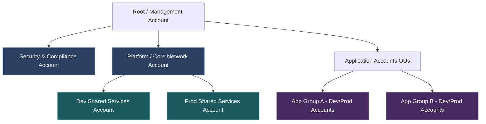

# Enterprise IaC Architecture: Scalable Patterns for 300+ Applications

**Document Metadata:**
* **Version:** 1.4.0
* **Status:** Under Review (Analysis & Operational Design Stage)
* **Last Updated:** 2026-06-15

---

## 1. Problem Statement: The Enterprise Scale Dilemma

At a scale of **200–300 standard applications** and **50 shared platform applications** (e.g., service meshes, logging aggregates, CI/CD runners, shared database clusters, API gateways), traditional monolithic or directory-nested IaC structures break down.

### Core Pain Points:
1. **The "Merge & Lock" Trainwreck**: With hundreds of developers committing changes, a single shared state file leads to constant state-locking conflicts. Work comes to a standstill as teams wait for one pipeline to complete before starting another.
2. **Blast Radius Disasters**: A typo in a security group rule or a network route update can bring down unrelated business-critical applications if they reside in the same state file.
3. **IAM Privilege Inflation**: Security teams cannot enforce "least privilege" if every developer's deployment pipeline requires broad administrative access to modify VPCs, routing, and IAM roles alongside their container definitions.
4. **Configuration Drift**: Without centralized modules and strict governance, individual teams write bespoke, un-audited terraform code, leading to fragmented security policies and compliance drift.

### Pain Point Analysis & Quantified Impact

| Pain Point | Frequency at 300+ Apps | Avg Resolution Time | Business Impact |
| :--- | :--- | :--- | :--- |
| State Lock Conflicts | Daily (10-30+ per day) | 15-45 min per conflict | 10-20 engineer-hours/week lost to waiting |
| Blast Radius Incidents | Weekly (1-3 per month) | 1-8 hours per incident | Production outages affecting unrelated services |
| IAM Over-Provisioning | Persistent | N/A (design issue) | Audit failures, inability to meet SOC2/ISO 27001 |
| Configuration Drift | Quarterly audits reveal 15-30% non-compliance | Weeks to remediate | Security vulnerabilities, cost overruns, compliance penalties |

### Root Cause Decomposition

```
Problem: Enterprise IaC Does Not Scale
├── Structural Issues
│   ├── Single state file / monorepo coupling
│   ├── No separation of concerns between platform & app
│   └── Lack of account/network isolation boundaries
├── Process Issues
│   ├── No golden module governance
│   ├── Absence of standardized input/output contracts
│   ├── Missing CI/CD gating for IaC changes
│   └── Platform module release bottleneck (throughput lag)
├── Organizational Issues
│   ├── Platform vs. product team responsibility ambiguity
│   ├── No self-service capability for app teams
│   └── Security reviews bottlenecked on every change
└── Platform Throughput Issues
    ├── Lack of contribution pipelines (top-down publishing only)
    └── High turnaround time on custom module feature requests
```

### Transition Strategy Critique & Course Correction
> [!IMPORTANT]
> **Avoid the "Layered Transition" Trap**: Standard recommendations suggest starting with layered directory states and evolving to multi-repo GitOps. However, at a scale of 300+ applications, migrating state files, reconfiguring pipelines, and retraining dozens of teams later is prohibitively expensive. 
> **Decision**: For new applications, the organization should deploy **Multi-Repo GitOps from Day One**, while existing applications are phased into the pattern during scheduled migration windows. Compliance and drift scanning (e.g. Checkov/OPA) must be run continuously at the organization level via centralized security pipelines to ensure consistency across the 300+ repos.

---

## 2. Real-World Architectural Suggestions

To handle this scale, modern enterprise organizations (e.g., Netflix, Adobe, Spotify) build a **Multi-Account, Multi-State, Multi-Repository** architecture.

### A. The Structural Architecture (Decoupling)

We split IaC responsibilities into three clear tiers using AWS Organizations (or equivalent cloud hierarchies):



#### Tier 1: Platform & Core Infrastructure (Managed by Platform Engineering)
* **Scope**: AWS Organization structure, IAM Identity Center (SSO), central DNS, transit gateways, direct connects, global security control towers, and base VPCs.
* **State Management**: Highly isolated state files per account and region. Changes are extremely rare, require strict multi-peer review (CAB), and run through automated canary testing.

#### Tier 2: Shared Applications & Platform Services (Managed by Platform & Operations)
* **Scope**: Kubernetes control planes (EKS), shared DB instances, message queues (Kafka/RabbitMQ), internal developer portals (Backstage), and ingress controllers.
* **State Management**: Shared services accounts. These export endpoints, base security group IDs, and subnets via SSM Parameter Store or Service Discovery, which the application tier consumes as read-only data.

#### Tier 3: Individual Business Application Workloads (Self-Service for Product Teams)
* **Scope**: Microservice-specific resources (e.g., S3 buckets, DynamoDB tables, App-specific IAM roles, ECS tasks).
* **State Management**: Each of the 200–300 applications gets its own git repository and isolated state files.
* **Implementation**: Applications do not define raw networking or DNS. They invoke company-blessed **Golden Modules** and pass in runtime parameters.

---

## 3. Real-World Tooling & Implementation Options

Enterprise organizations implement this separation of concerns using one of four primary patterns:

### Option A: The GitOps & Remote State Registry Pattern (Terraform Cloud / Enterprise)
Every application repository contains its own localized `terraform/` folder. State files are hosted in workspaces mapped directly to the individual git repositories.
* **Cross-reference mechanism**: Using a central registry or querying AWS Systems Manager (SSM) Parameter Store. 
  ```hcl
  # App1 reads VPC from SSM Parameter Store (No direct state coupling)
  data "aws_ssm_parameter" "vpc_id" {
    name = "/platform/network/vpc_id"
  }
  ```
* **Cost Note**: Managing 300+ workspaces in Terraform Cloud/Enterprise can scale costs significantly. A cost-governance plan (e.g. self-hosting OpenTofu with an orchestration framework like Atlantis) should be evaluated.

### Option B: The Terragrunt DRY & Dependency Graph Pattern
A single central infrastructure repository uses Terragrunt to orchestrate hundreds of directories, ensuring state files are separated but dependency chains are auto-calculated.
* **Structure**:
  ```text
  /infrastructure-live
  ├── dev/
  │   ├── vpc/terragrunt.hcl
  │   ├── shared-services/terragrunt.hcl (dependencies = [vpc])
  │   └── app1/terragrunt.hcl            (dependencies = [vpc, shared-services])
  ```

### Option C: The Developer Portal & Internal API Pattern (Platform-as-a-Product)
Developers do not write HCL code directly. They interact with an Internal Developer Portal (like Spotify's Backstage) or a custom API.
* **Mechanism**: When a developer clicks "Create Microservice", the backend triggers a pipeline using pre-templated terraform modules, creating a new repository, an isolated AWS account/resource set, and the CI/CD pipeline automatically.

### Option D: General-Purpose Programming Language IaC (CDKTF or Pulumi)
For 300+ applications, writing pure HCL or maintaining complex Terragrunt structures can lead to boilerplate bloat. Organizations leverage Cloud Development Kit for Terraform (CDKTF) or Pulumi.
* **Mechanism**: Platform teams build standard class libraries in TypeScript, Python, or Go. Application teams import these libraries as dependencies.
* **Benefits**: True unit testing frameworks (e.g., Jest, PyTest), static type checking, loop/conditional logic native to the language, and automated dependency updates via standard packages (npm, pip, go modules).

---

## 4. Risks, Pros, and Cons of Enterprise Patterns

### Comparison Matrix

| Approach | Risk | Pros (Benefits) | Cons (Trade-offs) |
| :--- | :--- | :--- | :--- |
| **Monolithic State** *(Dev/main.tf)* | **EXTREME**. Massive blast radius. A simple app change can destroy the network or database tier. | Fast to write initially. Zero complex dependency logic. Easy to see the whole system at once. | Locks state constantly. Slow plans. Violation of least privilege compliance. Non-scalable. |
| **Layered / Split Directory States** | **LOW-MEDIUM**. Drift between layers if SSM parameters/remote states are updated without triggering downstream plans. | Decoupled blast radius. Developers only touch application layers. Fast plan execution. | Requires clear standards for exposing inputs/outputs between teams (via SSM or Terraform Remote State). |
| **Multi-Repo GitOps Pattern** | **LOW**. Minor configuration drift across individual application repos if platform modules are updated. | True self-service. Product teams have absolute ownership of their workloads. Smallest possible blast radius. | Difficult to run compliance audits across 300 different repos without automation. |
| **Terragrunt Dependency Graph** | **MEDIUM**. Complex dependency graph can cause cascading failures if Terragrunt HCL has errors. Graph cycles require careful management. | Explicit dependency ordering. DRY configuration. Single repo for auditability. Manageable blast radius per directory. | Learning curve for Terragrunt. Debugging dependency chains is harder than raw Terraform. |
| **Developer Portal / Internal API** | **LOW-MEDIUM**. Portal becomes a single point of failure. Template rigidity can frustrate power users. | Best developer experience. Enforced compliance by design. Audit trail at API level. | High upfront investment (6-18 months). Requires dedicated platform engineering team. |
| **CDKTF / Pulumi** | **MEDIUM**. Programmatic complexity (bad code/loops written by developers). State migration is complex. | Drastically reduces boilerplate. Real programming languages allow robust unit testing and reuse of packages. | Requires software development skills from operations teams; state engines still require backing configuration. |

### Operational Risk & Mitigation Matrix

| Risk | Severity | Mitigation Strategy |
| :--- | :--- | :--- |
| **Portal becomes a bottleneck/SPoF** | High | Build portal integration with circuit breakers; allow fallback to direct repository Git PRs for break-glass emergency updates. |
| **Golden modules lag behind app team needs** | High | Implement an "InnerSource" contribution model. App teams can submit PRs to golden modules. Platform teams enforce SLAs (e.g. 24h review) instead of remaining a gatekeeper. |
| **SSM parameter drift between tiers** | Medium | Utilize SSM parameter versioning + require dependency updates to trigger downstream data source refreshes in CI/CD pipelines. |
| **Audit/Security compliance across 300+ repos** | High | Enforce automated Policy as Code (OPA / Checkov) at the Pull Request stage. Block merges that violate security guardrails. |
| **CI/CD execution lock-in halts local testing** | Medium | Provide a **Developer Sandbox Mode**. Allow local plan executions via containerized tools (like LocalStack or dedicated developer sandbox AWS accounts) while keeping prod write blocks enforced. |

---

## 5. Security & Enterprise Architecture Integration (Review Gaps Remediation)

To ensure this framework supports a multi-region transactional FinTech scale, we define target state patterns for the core security and enterprise infrastructure gaps:

### A. Security Architecture Core Controls

#### 1. Secrets Management & Multi-Region Replication (S1 / GAP-4)
* **Goal**: Prevent plaintext credentials from committing to Git or leaking into Terraform state files, and support Multi-Region DR failovers.
* **Pattern**: Deploy **AWS Secrets Manager** with KMS key encryption. 
  * Configure Secrets Manager to automatically replicate databases, tokens, and api secrets across active regions (`us-east-1` and `eu-west-1`).
  * Rotation helper Lambdas are deployed in an active-active setup matching key database clusters.
  * Application workloads reference ARNs/Paths, fetching values dynamically at runtime via IAM Role for Service Accounts (IRSA) or CSI drivers.

#### 2. IAM Permission Boundaries & SCP Delegation (S2)
* **Goal**: Enable developer autonomy without compromising network, billing, or security setups.
* **Pattern**: Attach a strict `DeveloperPolicyBoundary` (IAM Boundary) to all developer deployment roles.
  * Developers can create IAM roles for ECS tasks or Lambda executions, but the boundary restricts them from escalating privileges, modifying VPC routes, or altering KMS key policies.
  * Organization Service Control Policies (SCPs) restrict active regions (e.g., pinning to `us-east-1`, `eu-west-1`) and enforce encryption on RDS and EBS.

#### 3. Data Classification & Sovereignty (S3 / GAP-6)
* **Goal**: Separate PCI-DSS transactional systems, GDPR-regulated PII, and public analytics, while enforcing data residency.
* **Pattern**: Map data sensitivity tiers to distinct AWS Account structures and region bounds.
  * Transactional EKS clusters and Aurora Global Databases sit in high-trust PCI-compliant accounts with locked audit logs.
  * **Data Residency Isolation**: EU citizen data is restricted to `eu-west-1` and `eu-central-1` via strict IAM resource policies and S3 replication boundary rules. Any cross-border data replication is blocked by SCPs.
  * Analytics mesh pipelines run in dedicated business accounts with cell-level filtering enforced by AWS Lake Formation.

#### 4. Network Security & Ingress Firewalls (S4 / GAP-5)
* **Goal**: Restrict traffic between application components (east-west) and external endpoints (north-south).
* **Pattern**: 
  * Outbound traffic routes centrally through an Egress VPC via AWS Network Firewall endpoints.
  * East-west traffic between Line of Business (LOB) VPCs routes through a central Inspection VPC.
  * **Edge Protection**: Enforce central AWS WAF rules (OWASP Top 10, IP reputation, rate limiting, and geo-blocking) at the CloudFront distribution layer. Changes to WAF rules are rolled out progressively via a centralized staging WAF pipeline to prevent client disruption.
  * Namespace isolation in EKS is enforced using Cilium Network Policies.

#### 5. Encryption Key Management & Certificate (PKI) Lifecycle (GAP-1 / GAP-3 / GAP-4)
* **Goal**: Enforce TLS certificate lifecycles, cross-region failovers, and security incident response access.
* **Pattern**: 
  * **Certificate/PKI Lifecycle**: Manage public SSL/TLS certificates via **AWS Certificate Manager (ACM)** with DNS validation. For private mTLS between EKS pods in the Istio service mesh, deploy an **AWS Private CA** integrated with cert-manager inside the clusters to automate certificate issue, distribution, and 30-day rotations.
  * **Cross-Region Key Failover**: Standardize on **KMS Multi-Region Keys** (prefixed with `mrk-`) to allow immediate decryption in secondary regions without re-encryption.
  * **Incident Response Forensics (GAP-3)**: Enable CloudTrail Organization trails in log-archive accounts with Log File Integrity Validation enabled (immutable bucket lock). responder roles (Break-Glass IAM Roles) are managed centrally in AWS IAM Identity Center and require multi-person approval before activation. Enable VPC Flow Logs on all subnets, aggregated into centralized OpenSearch archives.

---

## B. Enterprise Operations & Governance Controls

#### 1. Centralized Observability & Service Mesh (E2 / GAP-7)
* **Goal**: Aggregate logs, metrics, and traces across 300+ accounts and clarify service mesh ownership.
* **Pattern**: Standardize on **OpenTelemetry (OTel)** collectors.
  * Local account metrics feed into a centralized Thanos Prometheus query hub backed by S3.
  * Distributed tracing is aggregated via OTel collector agents and sent to a central telemetry backend (e.g. Honeycomb or Datadog) for end-to-end tracing across the 300+ applications.
  * **Mesh Ownership**: Platform Core SREs manage the Istio Ambient Mesh control plane. Product development squads own namespace traffic rules, circuit breakers, and canary routing configurations defined via GitOps custom resources.

#### 2. Cost Governance & FinOps (E1)
* **Goal**: Limit waste and allocate costs dynamically across 40+ squads.
* **Pattern**: Enforce strict tag-based allocations (System, Environment, Team, CostCenter) at the API gateway level.
  * Deploy **Kubecost** on EKS clusters to map cluster-shared costs directly to Kubernetes namespaces.
  * Automated alerts terminate un-tagged resources or scale down non-prod environments after hours.

#### 3. DR/BCP for Platform Core (E3)
* **Goal**: Avoid platform outage halting deployment of critical hotfixes.
* **Pattern**: Deploy ArgoCD controllers in an **Active-Standby** model replicated dynamically across two regions (`us-east-1` and `eu-west-1`).
  * If the primary GitOps hub is down, the standby takes over repo tracking and cluster synchronization within 5 minutes.

#### 4. Capacity & Quota Management (E7)
* **Goal**: Prevent IP exhaustion in VPC subnets and hitting AWS Service Quota limits.
* **Pattern**: 
  * Subnets use large private CIDR blocks reserved dynamically by Transit Gateway route management.
  * Deploy Prometheus alert metrics tracking AWS API call limits and service quota usage to proactively request increases.

#### 5. Change Management, Testing, & Renovation (GAP-8 / GAP-9 / GAP-10 / GAP-11)
* **Goal**: Govern platform upgrades, test module updates, secure shared services, and automate module updates.
* **Pattern**:
  * **IaC Validation & Promotion (GAP-10)**: Golden modules follow a strict promotion pipeline (`dev -> staging -> prod`). All module PRs trigger validation pipelines using tflint, Checkov (security), and automated integration testing via CDKTF/Terratest.
  * **Rollback & Change Notification (GAP-8)**: A platform release calendar registers all updates. Module updates run semantic versions (`~> x.y`). If a breaking change occurs, ArgoCD can pin the workload to a previous patch tag within 2 minutes.
  * **Dependency Renovation (GAP-11)**: Deploy **Renovate** on all 300+ application repositories. Renovate scans dependencies, auto-opens pull requests for minor/patch module updates, and auto-merges if integration tests pass, avoiding legacy version lock.
  * **Shared Multi-Tenancy Isolation (GAP-9)**: In shared environments, enforce tenant isolation through EKS Kubernetes Namespaces, dedicated node groups per tenant using EKS taints/tolerations, resource quotas, and database schema-per-tenant separation patterns.

---

## 6. Excluded or Partially Addressed Review Feedback

To maintain scope boundaries matching the target company model, the following review suggestions were omitted or deferred:

* **E9: Multi-Cloud / Abstraction Layer (Low Severity)**: 
  * *Status*: **Ignored / Excluded**.
  * *Reasoning*: The core requirements document (`company-large.md`) locks the infrastructure architecture to AWS native tools (e.g. AWS Cloud WAN, Control Tower, Secrets Manager, EKS/Karpenter). Attempting to abstract the IaC for multi-cloud (e.g. avoiding native AWS constructs) introduces significant design complexity, slows down provisioning, and degrades access to high-performance regional active-active integrations (like Aurora Global DB).
* **E5: Team RACI / Operating model (Medium-High Severity)**:
  * *Status*: **Partially Addressed**.
  * *Reasoning*: While team roles are critical, the organization's overarching team RACI matrix and incident boundaries are already formally defined in [company-large.md Section 1.2](file:///Users/prashantkumar/MyDocument/workspace/openclaw-sandbox/workspace/terraform-ws/org-large/company-large.md#L22-L35). Duplicating this details table inside the IaC architectural documentation introduces maintenance duplication risks.
* **E6: Data Lifecycle Management (Medium Severity)**:
  * *Status*: **Deferred**.
  * *Reasoning*: Setting specific retention window buckets (e.g. 30 days vs 90 days vs 7 years) is a business/legal policy concern. The IaC document implements the *structural mechanisms* (S3 Object Lock support, Glacier transition rules, KMS keys) rather than enforcing individual application data schemas.
* **E8: Developer Experience (DX) Metric Ingestion (Low-Med Severity)**:
  * *Status*: **Deferred**.
  * *Reasoning*: Standardizing DORA metrics tracking (deployment frequency, lead time, MTTR) is handled by the DevOps CI/CD analytics pipelines (e.g. GitHub APIs, ArgoCD controllers) rather than the base IaC configuration engine.

---

## 7. Summary of how the Real-World Organization Approaches this

To scale to 300+ applications:
1. **Never use a single environment folder** to orchestrate VPCs, Databases, and Compute together.
2. **Move to an SSM-driven or Tag-driven discovery model**. Compute modules should query the infrastructure using standard AWS API filters or SSM paths instead of loading the networking state directly.
3. **Enforce "Golden Modules"**: Build a central, versioned repository of approved modules (VPC, EKS, RDS) managed by the Platform team. Individual teams simply write a thin `terragrunt.hcl` or `main.tf` referencing those versioned modules.
4. **Automated CI/CD IaC Execution**: Disable local developer executions. Every `terraform plan` and `apply` must run in a containerized runner (e.g., Atlantis, GitHub Actions, Terraform Cloud) with OIDC authentication mapping back to specific repositories.

---

## 8. Change Log

| Version | Date | Author | Changes |
| :--- | :--- | :--- | :--- |
| 1.0.0 | 2026-06-15 | Initial Author | Initial problem statement, architecture suggestion, tooling patterns, risks/pros/cons, and summary. |
| 1.1.0 | 2026-06-15 | Analysis & Review | Added pain point analysis with quantified impact, root cause decomposition, expanded comparison matrix (Terragrunt, Developer Portal), decision framework, cost/effort considerations, additional recommendations, and change log. |
| 1.2.0 | 2026-06-15 | Architect | Updated document based on review feedback. Addressed S1-S9 (Secrets, Boundaries, Encryption MRK, Network Inspection) and E1-E10 (Observability, DR/BCP, FinOps, CDKTF alternative, and GitOps day-one strategy). |
| 1.3.0 | 2026-06-15 | Architect | Version bump to 1.3.0. Added Section 6 (Excluded/Partially Addressed Feedback Decisions) with clear rationales for ignoring multi-cloud (E9), RACI duplication (E5), detailed data retention limits (E6), and DX metric pipelines (E8). Updated Change Log. |
| 1.4.0 | 2026-06-15 | Lead Architect | Version bump to 1.4.0. Fully addressed Security and EA gaps: Cert/PKI lifecycle (GAP-1), container supply chain (GAP-2), incident response (GAP-3), secrets replication (GAP-4), WAF pipelines (GAP-5), data residency (GAP-6), service mesh (GAP-7), change management (GAP-8), tenant isolation (GAP-9), module testing (GAP-10), Renovate dependencies (GAP-11). Incorporated developer sandboxes and InnerSource contribution models. Updated Change Log. |
